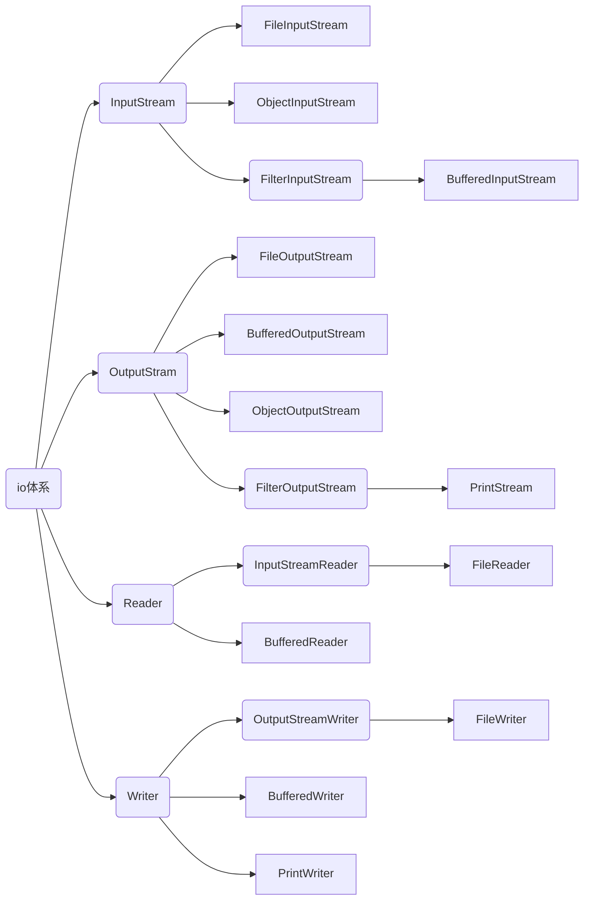

# io流体系图



InputStream,OutputStream,Reader,Writer是四个抽象类。


# FileInputStream

## read()

1. 读取下一个字节的数据
2. 返回该字节对应的一个int类型的0到255之间的值，达到文件末尾时返回-1

```java
import java.io.FileInputStream;
import java.io.IOException;

public void fileInputStream01() throws IOException {
        String path = "e:\\hello.txt";
        FileInputStream fileInputStream = new FileInputStream(path);
        int readData;
        while((readData = fileInputStream.read()) != -1) {
            System.out.print((char)readData);//将返回的int值转为char后打印
        }
        fileInputStream.close();
    }
```


## read(byte[] b)

1. 每次最多可以读取byte.length个字节的数据，效率大于read()
2. 返回实际读取到的字节数，最多为byte.length，读到文件末尾时返回-1

```java
import java.io.FileInputStream;
import java.io.IOException;

public void fileInputStream02() throws IOException {
        String path = "e:\\hello.txt";
        FileInputStream fileInputStream = new FileInputStream(path);
        byte[] bytes = new byte[8];//字节数组的大小决定每次最多可以读取多少个字节
        int readLen = 0;
        while((readLen = fileInputStream.read(bytes)) != -1) {
            //将读取到的字节数组转为String
            System.out.print(new String(bytes, 0, readLen));
        }
        fileInputStream.close();
    }
```


# FileOutputStream

1. 写入文件时，如果文件不存在，FileOutputStream将自动创建文件

2. 写入文件时，默认是覆盖原先内容写入，可以通过构造器指定为在原先内容的末尾写入

   ```java
   //构造器(filePath, append),将append设为true，使在末尾写入
   FileOutputStream fos = new FileOutputStream(filePath, true);
   ```

   

## write(int b)

写入一个字节的数据

```java
public void fileOutputSteam01() throws IOException {
        String path = "e:\\a.txt";
        FileOutputStream fileOutputStream = new FileOutputStream(path);
        fileOutputStream.write('o');
        fileOutputStream.close();
    }
```


## write(byte[] b)

写入一个字节数组

```java
public void fileOutputSteam02() throws IOException {
        String path = "e:\\a.txt";
        FileOutputStream fileOutputStream = new FileOutputStream(path);
        String str = "hello,world.";
        fileOutputStream.write(str.getBytes());//将字符串转为字节数组
        fileOutputStream.close();
    }
```


## write(byte[] b, int off, int len)

写入指定位置与长度的字节数组

```java
public void fileOutputSteam03() throws IOException {
        String path = "e:\\a.txt";
        FileOutputStream fileOutputStream = new FileOutputStream(path);
        String str = "hello,world.";
        fileOutputStream.write(str.getBytes(), 0, str.length);
        fileOutputStream.close();
    }
```


# FileReader


## read()

1. 每次读取单个字符
2. 读到文件末尾时，返回-1

```java
public void fileReader01() throws IOException {
        String path = "e:\\story.txt";
        FileReader fileReader = new FileReader(path);
        int data = 0;
        while((data = fileReader.read()) != -1) {
            System.out.print((char)data);
        }
        fileReader.close();
    }
```


## read(char[] chars)

1. 每次最多读取chars.length个字符
2. 返回实际读取到的字符的个数，最多为chars.length，读到文件末尾时返回-1

```java
public void fileReader02() throws IOException {
        String path = "e:\\story.txt";
        FileReader fileReader = new FileReader(path);
        int readLen = 0;
        char[] chars = new char[8];
        while((readLen = fileReader.read(chars)) != -1) {
            //将字符数组转为字符串
            System.out.print(new String(chars, 0, readLen));
        }
        fileReader.close();
    }
```


# FileWriter

write方法均无返回值

## write(int ch)

写入单个字符

```java
fileWriter.write('g');
```


## write(char[] chars)

写入指定数组

```java
fileWriter.write('a', 'b, 'c');
```


## write(char[] chars, off, len)

写入指定字符数组的指定部分

```java
fileWriter.write("origin真棒".toCharArray(), 0, 5);
```


## write(String str)

写入字符串

```java
fileWriter.write("hello,origin");
```


## write(String str, off, len)

写入字符串的指定部分

```java
fileWriter.write("hello,origin", 0, 5);
```


# 处理流/包装流

1. 包装流中，有一个Reader/Writer属性，可以封装一个结点流。例如BufferedReader可以封装任意一个Reader的子类。封装后的包装流可以对原有的结点流进行功能扩展。
2. 使用处理流时，只需要关闭外层流即可。


## BufferedReader

字符流

### readLine()

1. 读取一行
2. 读到文件末尾时返回null

```java
public void bufferedReader() throws IOException {
    String path = "e:\\story.txt";
    BufferedReader reader = new BufferedReader(new FileReader(path));
    String readLine = null;
    while ((readLine = reader.readLine()) != null) {
        System.out.println(readLine);//读完一行的内容之后需要换行
    }
    reader.close();
}
```


## BufferedWriter

字符流

### write(String str)

```java
public void bufferedWriter() throws IOException {
        String path = "e:\\b.txt";
        BufferedWriter writer = new BufferedWriter(new FileWriter(path));
        writer.write("hello,origin");
        writer.newLine();//write方法在写入时不会换行，所以需要手动换行
        writer.close();
    }
```


## BufferedInputStream

字节流


## BufferedOutPutStream

字节流


# 对象流


## 序列化和反序列化

1. 序列化，即在保存数据时，保存数据的值和数据类型
2. 反序列化，即在恢复数据时，回复数据的值和数据类型
3. 如果希望一个类可以被序列化，需要实现Serializable接口
4. 对象流是处理流
5. private static final long serialVersonUID = 1L;
6. static和transient修饰的属性不会被序列化
7. 序列化对象时，要求里面的属性也实现序列化接口
8. 序列化具备可继承性


## ObjectOutputStream

使用ObjectOutputStream序列化不同数据类型的对象

```java
objectOutputStream.writeInt(100); 
objectOutputStream.writeDouble(16.6);
objectOutputStream.writeBoolean(true);
objectOutputStream.writeChar('o');
objectOutputStream.writeUTF("hello,origin");
objectOutputStream.writeObject(new Dog("小黄", yellow));//序列化实现了Serializable接口的Dog对象
```


## ObjectInputStream

反序列化的顺序必须和序列化的顺序一致

```java
System.out.println(objectInputStream.readInt());
System.out.println(objectInputStream.readDouble());
System.out.println(objectInputStream.readBoolean());
System.out.println(objectInputStream.readChar());
System.out.println(objectInputStream.readUTF());
```


# 转换流

字符流在读取时默认使用的是utf-8编码，因此当读取的文件不是utf-8编码时就会出现乱码。

转换流可以指定字节流的charset并将字节流转换为字符流。


## InputStreamReader

1. InputStreamReader是字符流
2. 指定FileInputStream的charset并将其包装成InputStreamReader，再包装成处理流BufferedReader

```java
public void inputStreamReader() throws IOException {
        String path = "e:\\b.txt";
        BufferedReader reader = new BufferedReader(new InputStreamReader(new 														FileInputStream(path), "gbk"));
        String s = reader.readLine();
     	reader.close();
        System.out.println(s);
    }
```


## OutputStreamWriter

```java
public void outputStreamWriter() throws IOException {
        String path = "e:\\c.txt";
        BufferedWriter writer = new BufferedWriter(new OutputStreamWriter(new 													FileOutputStream(path), "utf-8"));
        writer.write("hello,origin");
        writer.close();
    }
```


# 配置文件

 

xxx.properties即为一个配置文件

配置文件的格式为key=value

使用properties类可以方便地读取配置文件


## 读取配置文件

```java
Properties properties = new Properties();
properties.load(new FileReader("src\\mysql.properties"));
//显示所有的k-v
properties.list(System.out);
//根据key获取value
String root = properties.getProperty("root");
```


## 创建配置文件

```java
Properties properties = new Properties();
properties.setProperty("root", "jack");
properties.setProperty("ip", "192.168.100.100");
//将properties存储为指定文件
properties.store(new FileWriter("src\\test.properties"), null);
```

