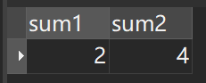
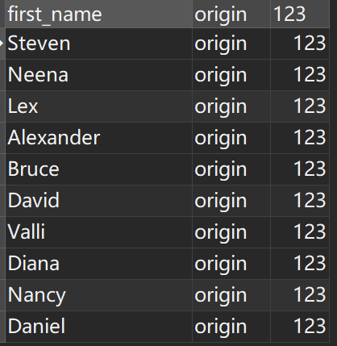
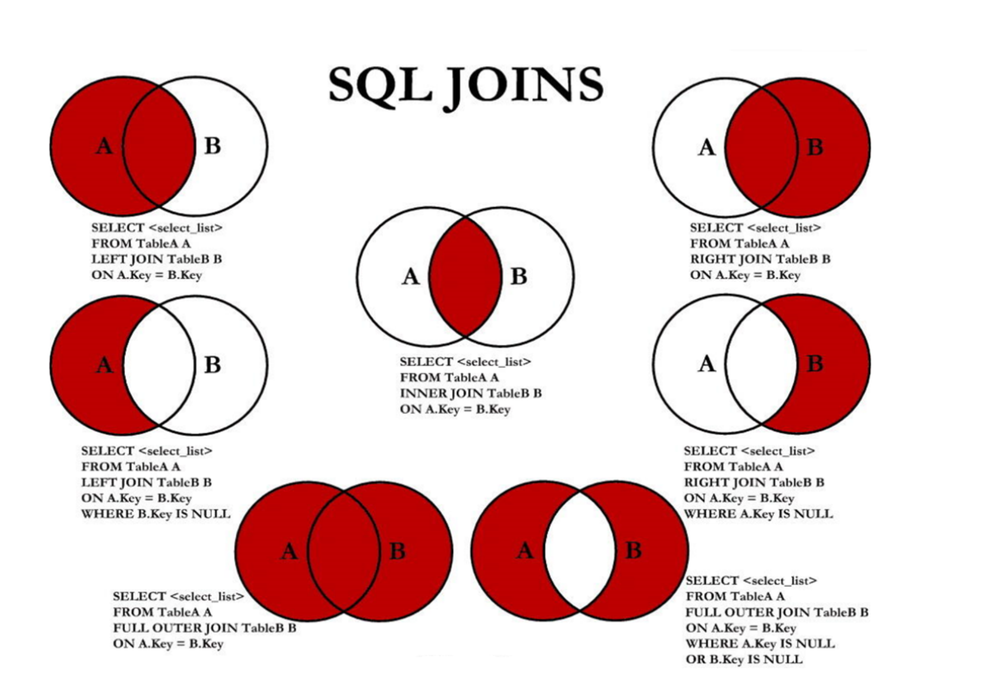
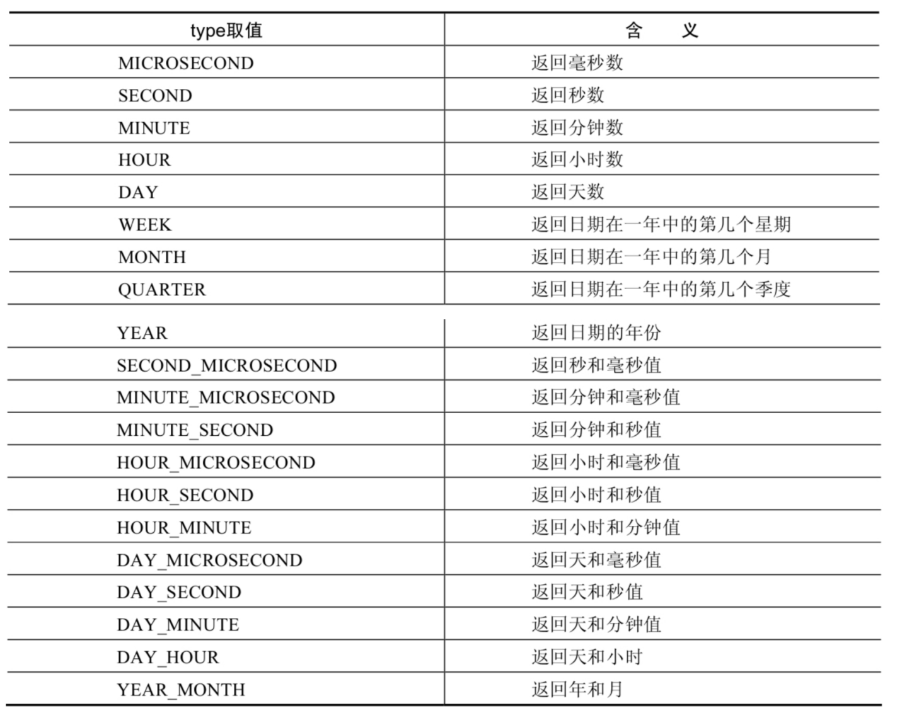
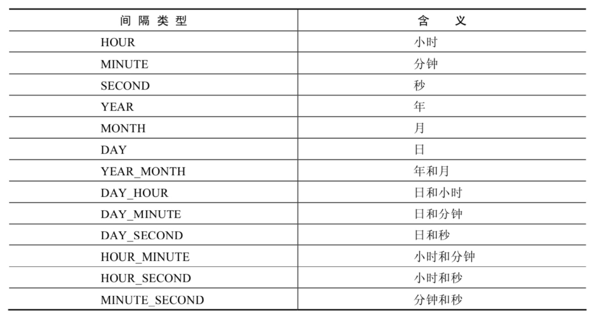
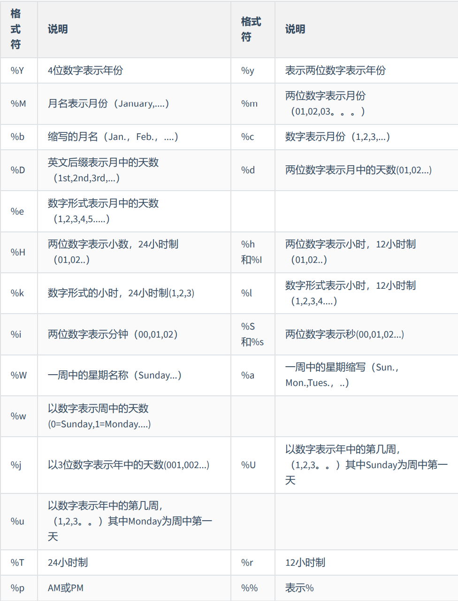
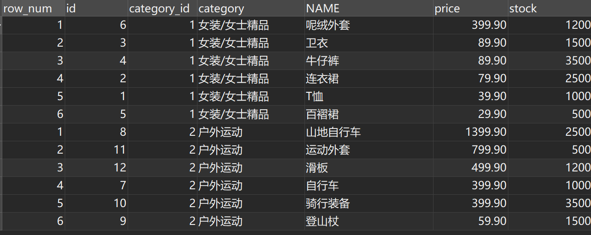

# hello,world

## 数据库相关概念

**db**: 数据库,具体的数据库,本质是一个文件,保存数据

**dbms**: 数据库管理系统,用户管理和维护数据库,例如mysql,oracle

**sql**:  结构化查询语言,专门与数据库通信的语言


## mysql安装

1. 可以同时安装不同的版本，只要保证端口号不相同即可
2. Path变量下，哪个版本的bin目录在前，登录时就优先登录哪个版本，也使用不同的端口号来指定登录不同版本的mysql


## mysql开启/停止服务

需要以管理员身份运行cmd

```
net start mysql80
net stop mysql80
```


## 登录mysql

一般把密码-p写在最后，其他顺序随意，端口号-P和IP可以省略

```
mysql -u root -P 13306 -h localhost -p
```


## sql分类


**DDL** 数据定义语言

- CREATE
- ALTER 修改
- DROP
- RENAME 重命名
- TRUNCATE 

**DML** 数据操作语言

- INSERT
- DELETE
- UPDATE
- SELECT

**DCL** 数据控制语言

- COMMIT 提交
- ROLLBACK 回滚
- SAVEPOINT
- GRANT
- REVOKE


# 基本select

操作某个具体的数据库前先要使用下列语句

```sql
use dbtest01;
```


## 基本查询

查询1 + 1 和2 + 2

```sql
SELECT 1 + 1, 2 + 2;
```


## 列的别名

- AS可省略
- 别名如果没有空格,则双引号可省略

```sql
SELECT 1 + 1 AS sum1, 2 + 2 sum2;
```




## 去重查询

使用`distinct`实现去重查询

```sql
select DISTINCT department_id from employees
```

如果`distinct`后面跟了多个要查询的列名，那么去重的规则就是，当所有列的值都相同时才算作重复


## 空值参与运算

空值即null，null参与的运算结果一定为null


## 着重号

着重号即``，当我们的自定义命名和关键字冲突时，就可以用着重号区分关键字和自定义命名


## 查询常数

这里的origin和123就是常数，他们会在表中自动补全为一列

```sql
SELECT first_name, "origin", 123 FROM employees;
```




## 显示表结构

可以简写为DESC

```sql
DESCRIBE employees;
```


## 过滤查询

使用where关键字，where后面跟的是表达式，只有令表达式为真的行才会被显示

```sql
SELECT * FROM employees WHERE first_name = 'Lex';
```


# 运算符


## 隐式转换

字符串存在隐式转换，例如

```sql
select 1 = '1' FROM DUAL;
```

返回的是1，即true


当理论上无法进行隐式转换时，例如

```sql
SELECT 1 = 'a' FROM DUAL;//返回0，即false
```

此时'a'会被转换成0


## 安全等于

null = null的结果为null

<=> 表示安全等于，null <=> null 的结果为1


## 常用运算

- **IS NULL** 是否为null
- **IS NOT NULL** 是否不为null 
- **LEAST(var1, var2, ...)** 返回参数中的最小值
- **GREATEST(var1, var2, ...)** 返回参数中的最大值
- **BETWEEN ... AND ...** 查询某个范围内的数据，包含边界值
- **IN(var1, var2, ...)** 参数传递的是元素值点集，如果值在该点集中就返回true
- **NOT IN(var1, var2, ...)** 
- **LIKE 'a%'** %代表0个或任意个字符，此处表示选出以a开头的字符串
- **LIKE '_a%'** _代表一个字符，此处表示选出第二个字符为a的字符串
- **... REGEXP ...** 正则表达式匹配


## 逻辑运算符

- **！**非
- **OR** 或 
- **AND** 并且
- **XOR** 逻辑异或


# 排序

没有使用排序操作则默认按添加顺序显示

使用 ORDER BY 进行排序，默认为升序排列(ASC)

```sql
SELECT * FROM employees ORDER BY salary;
```


使用DESC进行降序排列

```sql
SELECT * FROM employees ORDER BY salary DESC;
```


在ORDER BY 后添加多个排序对象实现多级排序

```sql
SELECT last_name, salary ,department_id 
FROM employees
ORDER BY department_id, salary;//先按department_id排序，再按salary排序
```


## sql执行顺序

例如有下面的sql

```sql
SELECT employee_id id, salary 
FROM employees
where department_id in(50, 60, 70)
order by id DESC;
```

执行时，先执行from，和where，再执行select，最后执行order by，因此可以得出

1. 列的别名不能在where中使用，可以在order by中使用
2. where需要声明在from之后，order by之前


# 分页

使用limit关键字，limit后面的第一个数字表示偏移量，第二个数字表示显示的数据个数

例如此处从第二十一条数据开始，查询二十条数据

```sql
SELECT * FROM employees LIMIT 20, 20;
SELECT * FROM employees LIMIT 20;//可以省略偏移量，则偏移量为默认值0
select * from employees LIMIT 2 OFFSET 0;//mysql8.0中的新写法，第一个数字为数据量，第二个为偏移量
```

limit写在select语句的最后


# 多表查询

## 笛卡尔积

当同时查询两张表时，会将第一张表的每条记录与第二张表的每条记录进行拼接，例如

```sql
SELECT *
FROM employees, departments;
```

employees表有107条数据，departments有27条数据，查询后共有107 * 27 = 2889条数据

这样查询出来的表叫做笛卡尔积


因此查询两张表时需要加上拼接条件

```sql
SELECT *
FROM employees, departments
WHERE employees.department_id = departments.department_id;
```


## ambiguous

多表查询时，当我们想要查询两张表中共有的字段时，需要给该共同字段指定一个对象

```sql
#错误，Column 'department_id' in field list is ambiguous
SELECT department_id
FROM employees, departments
WHERE employees.department_id = departments.department_id;

#正确
SELECT employees.department_id 
FROM employees, departments
WHERE employees.department_id = departments.department_id;

```


## 表的别名

可以给表起别名以简化代码

如果给表起了别名，那么在使用表时就必须要用别名

```sql
SELECT t2.department_id 
FROM employees t1, departments t2
WHERE t1.department_id = t2.department_id;
```


## 自连接

多表查询的多表不一定是指不同的表，也可以是多个相同的表，例如

```sql
#查询员工的id，姓名和其管理者的id和姓名
SELECT t1.employee_id, t1.last_name, t2.employee_id, t2.last_name
FROM employees t1, employees t2
WHERE t1.manager_id = t2.employee_id;
```


## SQL99中的多表查询

到目前为止所写的SQL都属于SQL92语法

在SQL99中，多表查询如下

```sql
SELECT t1.last_name, t1.department_id
FROM employees t1 JOIN departments t2 
ON t1.department_id = t2.department_id
```

即使用JOIN ON组合，JOIN后写需要添加的表，ON后写该表与主表（t1）的拼接条件


## 内连接&外连接

多表查询时，需要加上连接条件，这会导致总有一些数据不满足连接条件，这样这些数据就无法加入查询后的结果表中，例如

```sql
SELECT t1.last_name, t1.department_id
FROM employees t1, departments t2
WHERE t1.department_id = t2.department_id;
```

当employees表中有一个员工的department_id为null时，该员工就不会加入结果表

这样的不包含不满足多表连接条件的查询叫做内连接

外连接即将不满足连接条件的数据也加入到结果表中，外连接分为左外连接,右外连接和满外连接


## 左外连接&右外连接

**左外连接**：LEFT JOIN...ON...即左侧表的数据完全显示，即使不满足连接条件，例如

```sql
SELECT t1.last_name, t1.department_id
FROM employees t1 LEFT JOIN departments t2 
ON t1.department_id = t2.department_id
```

这里如果t1中有一个员工的department_id=null，那么该员工的信息也会显示出来


**右外连接**：RIGHT JOIN...ON...即右侧的表完全显示，即使不满足连接条件，例如

```sql
SELECT t1.last_name, t1.department_id
FROM employees t1 RIGHT JOIN departments t2 
ON t1.department_id = t2.department_id
```

这里t2中如果有没有员工的部门，那么这些部门也会显示出来


## union

union关键字用于合并查询结果,连接在两个select语句中间

例如: 查询部门编号>90或邮箱包含a的员工信息

```sql
SELECT * FROM employees WHERE email LIKE '%a%'
UNION
SELECT * FROM employees WHERE department_id>90;
```


除了union,还可以使用union all关键字,区别如下:

**union**: 返回两个select语句查询结果的并集,去除重复记录

**union all**: 返回两个select语句查询结果的并集,不去除重复记录

> 由于union all没有去除重复记录这一步骤,性能更好,因此我们通常会选择使用union all,但由于union all不去除重复记录,因此我们要尽量选择没有重复记录的select合并


## sql join

即使用外连接和union来查询两张表的指定部分




**中图**: 内连接

**左上图**: 左外连接

**右上图**: 右外连接

**左中图**: 即查询左外连接中左表不满足连接条件的行,这些行的右表连接条件都为null,因此先查询左外连接,再筛选出右表连接条件为null的数据

```sql
SELECT employee_id,last_name,department_name
FROM employees e LEFT JOIN departments d
ON e.`department_id` = d.`department_id`
WHERE d.`department_id` IS NULL
```

**右中图**: 即查询右外连接中右表不满足连接条件的行,这些行的左表连接条件都为null,先查询右外连接,再筛选出左表连接条件为null的数据

```sql
SELECT employee_id,last_name,department_name
FROM employees e RIGHT JOIN departments d
ON e.`department_id` = d.`department_id`
WHERE e.`department_id` IS NULL
```

**左下图**: 即满外连接,左上图+右中图 或者 右上图+左中图, 使用union all连接

```sql
# 左中图 + 右上图 A∪B
SELECT employee_id,last_name,department_name
FROM employees e LEFT JOIN departments d
ON e.`department_id` = d.`department_id`
WHERE d.`department_id` IS NULL
UNION ALL #没有去重操作，效率高
SELECT employee_id,last_name,department_name
FROM employees e RIGHT JOIN departments d
ON e.`department_id` = d.`department_id`;
```

**右下图**: 左中图+右中图

```sql
select t1.last_name, t2.department_id
from employees t1 left join departments t2
on t1.department_id = t2.department_id
where t2.department_id is null
union all
select t1.last_name, t2.department_id
from employees t1 right join departments t2
on t1.department_id = t2.department_id
where t1.department_id is null
```


## sql99语法新特性


### natural join

自动我们查询两张表中等值的字段进行连接

例如,sql92中的

```sql
SELECT employee_id,last_name,department_name
FROM employees e JOIN departments d
ON e.`department_id` = d.`department_id`
AND e.`manager_id` = d.`manager_id`;
```

使用natural join后

```sql
SELECT employee_id,last_name,department_name
FROM employees e NATURAL JOIN departments d;
```


### using

使用using可以简化join on语法,例如

```sql
SELECT employee_id,last_name,department_name
FROM employees e ,departments d
WHERE e.department_id = d.department_id;
```

使用using后

```sql
SELECT employee_id,last_name,department_name
FROM employees e JOIN departments d
USING (department_id);
```


# 函数

## 单行函数


### 数值函数

| 函数                | 用法                                                         |
| ------------------- | ------------------------------------------------------------ |
| ABS(x)              | 返回x的绝对值                                                |
| SIGN(X)             | 返回X的符号。正数返回1，负数返回-1，0返回0                   |
| PI()                | 返回圆周率的值                                               |
| CEIL(x)，CEILING(x) | 返回大于或等于某个值的最小整数                               |
| FLOOR(x)            | 返回小于或等于某个值的最大整数                               |
| LEAST(e1,e2,e3…)    | 返回列表中的最小值                                           |
| GREATEST(e1,e2,e3…) | 返回列表中的最大值                                           |
| MOD(x,y)            | 返回X除以Y后的余数                                           |
| RAND()              | 返回0~1的随机值                                              |
| RAND(x)             | 返回0~1的随机值，其中x的值用作种子值，相同的X值会产生相同的随机数 |
| ROUND(x)            | 返回一个对x的值进行四舍五入后，最接近于X的整数               |
| ROUND(x,y)          | 返回一个对x的值进行四舍五入后最接近X的值，并保留到小数点后面Y位 |
| TRUNCATE(x,y)       | 返回数字x截断为y位小数的结果                                 |
| SQRT(x)             | 返回x的平方根。当X的值为负数时，返回NULL                     |
| BIN(x)              | 返回x的二进制编码                                            |
| HEX(x)              | 返回x的十六进制编码                                          |
| OCT(x)              | 返回x的八进制编码                                            |
| CONV(x,f1,f2)       | CONV(x,f1,f2)                                                |


### 字符串函数

| 函数                           | 用法                                                         |
| ------------------------------ | ------------------------------------------------------------ |
| ASCII(S)                       | 返回字符串S中的第一个字符的ASCII码值                         |
| CHAR_LENGTH(s)                 | 返回字符串s的字符数。作用与CHARACTER_LENGTH(s)相同           |
| LENGTH(s)                      | 返回字符串s的字节数，和字符集有关                            |
| CONCAT(s1,s2,......,sn)        | 连接s1,s2,......,sn为一个字符串                              |
| CONCAT_WS(x,s1,s2,......,sn)   | 同CONCAT(s1,s2,...)函数，但是每个字符串之间要加上x           |
| INSERT(str,idx,len,replacestr) | 将字符串str从第idx位置开始，len个字符长的子串替换为字符串replacestr |
| REPLACE(str, a, b)             | 用字符串b替换字符串str中所有出现的字符串a                    |
| UPPER(s) 或 UCASE(s)           | 将字符串s的所有字母转成大写字母                              |
| LOWER(s) 或LCASE(s)            | 将字符串s的所有字母转成小写字母                              |
| LEFT(str,n)                    | 返回字符串str最左边的n个字符                                 |
| RIGHT(str,n)                   | 返回字符串str最右边的n个字符                                 |
| LPAD(str, len, pad)            | 用字符串pad对str最左边进行填充，直到str的长度为len个字符     |
| RPAD(str ,len, pad)            | 用字符串pad对str最右边进行填充，直到str的长度为len个字符     |
| LTRIM(s)                       | 去掉字符串s左侧的空格                                        |
| RTRIM(s)                       | 去掉字符串s右侧的空格                                        |
| TRIM(s)                        | 去掉字符串s开始与结尾的空格                                  |
| TRIM(s1 FROM s)                | 去掉字符串s开始与结尾的s1                                    |
| TRIM(LEADING s1 FROM s)        | 去掉字符串s开始处的s1                                        |
| TRIM(TRAILING s1 FROM s)       | 去掉字符串s结尾处的s1                                        |
| REPEAT(str, n)                 | 返回str重复n次的结果                                         |
| SPACE(n)                       | 返回n个空格                                                  |
| STRCMP(s1,s2)                  | 比较字符串s1,s2的ASCII码值的大小                             |
| SUBSTR(s,index,len)            | 返回从字符串s的index位置其len个字符，作用与SUBSTRING(s,n,len)、 MID(s,n,len)相同 |
| LOCATE(substr,str)             | 返回字符串substr在字符串str中首次出现的位置，作用于POSITION(substr IN str)、INSTR(str,substr)相同。未找到，返回0 |
| ELT(m,s1,s2,…,sn)              | 返回指定位置的字符串，如果m=1，则返回s1，如果m=2，则返回s2，如 果m=n，则返回sn |
| FIELD(s,s1,s2,…,sn)            | 返回字符串s在字符串列表中第一次出现的位置                    |
| FIND_IN_SET(s1,s2)             | 返回字符串s1在字符串s2中出现的位置。其中，字符串s2是一个以逗号分 隔的字符串 |
| REVERSE(s)                     | 返回s反转后的字符串                                          |
| NULLIF(value1,value2)          | 比较两个字符串，如果value1与value2相等，则返回NULL，否则返回 value1 |


### 日期和时间函数

| 函数                                                         | 用法                                                         |
| ------------------------------------------------------------ | ------------------------------------------------------------ |
| CURDATE() ，CURRENT_DATE()                                   | 返回当前日期，只包含年、 月、日                              |
| CURTIME() ， CURRENT_TIME()                                  | 返回当前时间，只包含时、 分、秒                              |
| NOW() / SYSDATE() / CURRENT_TIMESTAMP() / LOCALTIME() / LOCALTIMESTAMP() | 返回当前系统日期和时间                                       |
| UTC_DATE()                                                   | 返回UTC（世界标准时间）日期                                  |
| UTC_TIME()                                                   | 返回UTC（世界标准时间）时间                                  |
| UNIX_TIMESTAMP()                                             | 以UNIX时间戳的形式返回当前时间                               |
| UNIX_TIMESTAMP(date)                                         | 将时间date以UNIX时间戳的形式返回                             |
| FROM_UNIXTIME(timestamp)                                     | 将UNIX时间戳的时间转换为普通格式的时间                       |
| YEAR(date) / MONTH(date) / DAY(date)                         | 返回具体的日期值                                             |
| HOUR(time) / MINUTE(time) / SECOND(time)                     | 返回具体的时间值                                             |
| MONTHNAME(date)                                              | 返回月份：January，...                                       |
| DAYNAME(date)                                                | 返回星期几: MONDAY,TUESDAY.....SUNDAY                        |
| WEEKDAY(date)                                                | 返回周几，注意，周1是0，周2是1，。。。周日是6                |
| QUARTER(date)                                                | 返回日期对应的季度，范围为1～4                               |
| WEEK(date) ， WEEKOFYEAR(date)                               | 返回一年中的第几周                                           |
| DAYOFYEAR(date)                                              | 返回日期是一年中的第几天                                     |
| DAYOFMONTH(date)                                             | 返回日期位于所在月份的第几天                                 |
| DAYOFWEEK(date)                                              | 返回周几，注意：周日是1，周一是2，。。。周六是 7             |
| EXTRACT(type FROM date)                                      | 返回指定日期中特定的部分，type指定返回的值[^extract中type的可选值] |
| TIME_TO_SEC(time)                                            | 将`时:分:秒`转化为秒并返回结果值。转化的公式为： 小时*3600+分钟 *60+秒 |
| SEC_TO_TIME(seconds)                                         | 将 seconds 描述转化为包含小时、分钟和秒的时间                |
| DATE_ADD(datetime, INTERVAL expr type)， ADDDATE(date,INTERVAL expr type) | 返回与给定日期时间相差INTERVAL时 间段的日期时间,例如date_add(now(), interval 1 YEAR)表示获取在当前时间基础上加一年的时间[^日期计算中type的可选值] |
| DATE_SUB(date,INTERVAL expr type)， SUBDATE(date,INTERVAL expr type) | 返回与date相差INTERVAL时间间隔的 日期                        |
| ADDTIME(time1,time2)                                         | 返回time1加上time2的时间。当time2为一个数字时，代表的是 秒 ，可以为负数,例如`select addtime('00:00:12', '00:06:00')` |
| SUBTIME(time1,time2)                                         | 返回time1减去time2后的时间。当time2为一个数字时，代表的 是 秒 ，可以为负数 |
| DATEDIFF(date1,date2)                                        | 返回date1 - date2的日期间隔天数                              |
| TIMEDIFF(time1, time2)                                       | 返回time1 - time2的时间间隔                                  |
| FROM_DAYS(N)                                                 | 返回从0000年1月1日起，N天以后的日期                          |
| TO_DAYS(date)                                                | 返回日期date距离0000年1月1日的天数                           |
| LAST_DAY(date)                                               | 返回date所在月份的最后一天的日期                             |
| MAKEDATE(year,n)                                             | 针对给定年份与所在年份中的天数返回一个日期,例如select makedate('2022', 1)返回2022-01-01 |
| MAKETIME(hour,minute,second)                                 | 将给定的小时、分钟和秒组合成时间并返回                       |
| PERIOD_ADD(time,n)                                           | 返回time加上n后的时间                                        |
| DATE_FORMAT(date,fmt)                                        | 按照字符串fmt格式化日期date值[^fmt的格式]                    |
| TIME_FORMAT(time,fmt)                                        | 按照字符串fmt格式化时间time值                                |
| GET_FORMAT(date_type,format_type)                            | 返回日期字符串的显示格式                                     |
| STR_TO_DATE(str, fmt)                                        | 按照字符串fmt对str进行解析，解析为一个日期                   |


### 流程控制函数

| 函数                                                         | 用法                                                    |
| ------------------------------------------------------------ | ------------------------------------------------------- |
| IF(value,value1,value2)                                      | 如果value的值为TRUE，返回value1， 否则返回value2        |
| IFNULL(value1, value2)                                       | 如果value1不为NULL，返回value1，否 则返回value2         |
| CASE WHEN 条件1 THEN 结果1 WHEN 条件2 THEN 结果2 .... [ELSE resultn] END | 相当于Java的if...else if...else...[^case when then举例] |
| CASE expr WHEN 常量值1 THEN 值1 WHEN 常量值1 THEN 值1 .... [ELSE 值n] END | 相当于Java的switch...case..[^case expr when then举例]   |


### 加密和解密函数

| 函数     | 用法                                                         |
| -------- | ------------------------------------------------------------ |
| MD5(str) | 返回字符串str的md5加密后的值，也是一种加密方式。若参数为 NULL，则会返回NULL |
| SHA(str) | 从原明文密码str计算并返回加密后的密码字符串，当参数为 NULL时，返回NULL。 SHA加密算法比MD5更加安全 。 |


## 聚合函数

- **AVG()** 平均值
- **SUM()** 总和
- **MAX()** 最大值
- **MIN()** 最小值
- **COUNT()** 计数,count(*)返回表中记录总数,包括null值,count(列名)返回表中不为null的记录总数

注意:聚合函数不可嵌套使用

## group by

查询结果默认是一组,如果想多组进行查询,可以使用group by

```sql
SELECT department_id, AVG(salary)
FROM employees
GROUP BY department_id ;
```


也可以使用多个列进行分组,按照顺序进行分组

```sql
SELECT department_id dept_id, job_id, SUM(salary)
FROM employees
GROUP BY department_id, job_id ;# 先按照department_id分组,再按照iob_id分组
```


**with rollup**

使用 WITH ROLLUP 关键字之后，在所有查询出的分组记录之后增加一条记录，该记录计算查询出的所 有记录的总和，即统计记录数量

```sql
SELECT department_id,AVG(salary)
FROM employees
WHERE department_id > 80
GROUP BY department_id WITH ROLLUP;
```


## having

使用where的时候,如果过滤条件中使用了聚合函数,那么就必须使用having来替换where,且having必须声明在group by的后面

```sql
# 查询员工按照部分分组后每组的最大工资数大于10000的部门id和最大工资数
select department_id, max(salary) maxSaraly
from employees
group by department_id
having maxSaraly > 10000
```


## sql执行顺序

sql92语法顺序

```sql
SELECT ...,....,...
FROM ...,...,....
WHERE 多表的连接条件
AND 不包含组函数的过滤条件
GROUP BY ...,...
HAVING 包含组函数的过滤条件
ORDER BY ... ASC/DESC
LIMIT ...,...
```


sql99语法顺序

```sql
SELECT ...,....,...
FROM ... JOIN ...
ON 多表的连接条件
JOIN ...
ON ...
WHERE 不包含组函数的过滤条件
AND/OR 不包含组函数的过滤条件
GROUP BY ...,...
HAVING 包含组函数的过滤条件
ORDER BY ... ASC/DESC
LIMIT ...,...
```


sql执行顺序:

1. from
2. join on
3. where
4. group by
5. having
6. select
7. order by
8. limit


[^extract中type的可选值]: 
[^日期计算中type的可选值]: 
[^fmt的格式]: 
[^case when then举例]: SELECT employee_id,salary, CASE WHEN salary>=15000 THEN '高薪' WHEN salary>=10000 THEN '潜力股' WHEN salary>=8000 THEN '屌丝' ELSE '草根' END "描述" FROM employees;
[^case expr when then举例]: SELECT last_name, job_id, salary, CASE job_id WHEN 'IT_PROG' THEN 1.10*salary WHEN 'ST_CLERK' THEN 1.15*salary WHEN 'SA_REP' THEN 1.20*salary ELSE salary END "REVISED_SALARY" FROM employees;


# 子查询

子查询指一个查询语句嵌套在另一个查询语句内部的查询


## 单行子查询

即子查询返回的是单行记录

```sql
# 查询工资大于abel的工资的员工
SELECT last_name,salary
FROM employees
WHERE salary > (
                SELECT salary
                FROM employees
                WHERE last_name = 'Abel'
                )
```

注意:

- 子查询在主查询之前执行完成,子查询的结果被主查询使用
- 子查询要包含在括号内
- 将子查询放在比较括号的右侧


## 多行子查询

即子查询返回的结果是多行记录

因为子查询返回多行记录,所以多行子查询有特有的比较符号

- **IN** 等于列表中的某一个
- **ANY** 和基本比较符号一起用,例如`<any`表示小于任意一个
- **ALL** 和所有值比较
- **SOME** any的别名,作用相同


IN举例

```sql
# 查询每个部门工资最低的员工的信息
select last_name, salary
from employees
where salary in (select min(salary) from employees group by department_id)
```


ANY举例

```sql
# 查询其他job_id中比job_id为'IT_PROG'部门中的任意一个员工的工资低的员工的信息
select employee_id, last_name, job_id, salary
from employees
where job_id <> 'IT_PROG' and salary <any (select salary from employees where job_id = 'IT_PROG')
```


ALL举例

```sql
# 查询其他job_id中比job_id为'IT_PROG'部门中的所有员工的工资都低的员工的信息
select employee_id, last_name, job_id, salary
from employees
where job_id <> 'IT_PROG' and salary <all (select salary from employees where job_id = 'IT_PROG')
```


### 空值问题

例如,查询所有经理的id

```sql
SELECT last_name
FROM employees
WHERE employee_id IN (
    SELECT manager_id
    FROM employees
)
```

如果改为查询所有非经理的id,即使用not in

```sql
SELECT last_name
FROM employees
WHERE employee_id not IN (
    SELECT manager_id
    FROM employees
);
```

此时,如果子查询中有null值,那么查询将失败,因此要先将子查询中的空值去除

```sql
SELECT last_name
FROM employees
WHERE employee_id not IN (
    SELECT manager_id
    FROM employees
    WHERE manager_id IS NOT null
);
```


### 练习

**查询平均工资最低的部门id**

```sql
# 方式一:先查询所有部门的平均工资,将其看成一张表,再从这张表中查询出最小平均工资,最后再查询平均工资等于该最小平均工资的部门
select department_id
from employees
group by department_id
having avg(salary) = (select min(t1.avg_sal)
                      from (select avg(salary) avg_sal
                            from employees
                            group by department_id) t1)
```


```sql
# 方式二:子查询查出所有部门的平均工资,主查询使用<=all,即查询小于等于所有部门平均工资的部门,即查询平均工资最小的部门
select department_id
from employees
group by department_id
having avg(salary) <=all (select avg(salary) avg_sal
                            from employees
                            group by department_id)
```


## 相关子查询

**不相关子查询**: 子查询只执行一次,然后用子查询得到的结果跟主查询中的数据一一对比,可以理解每次比较子查询都是一个常量

例如,*查询员工工资大于本公司员工平均工资的员工信息*,这里的子查询是`本公司员工平均工资`,属于常量数据,只需执行一次

```sql
select last_name, salary, department_id
from employees
where salary > (select avg(salary) from employees)
```


**相关子查询**: 子查询的执行依赖于外部查询,例如子查询使用了外部表,即每执行一次外部查询，子查询都要重新计算一次

例如,*查询员工工资大于本部门员工平均工资的员工信息*,这里的子查询是`本部门员工平均工资`,与主查询相关,每次主查询都要重新计算一次

```sql
select last_name, salary, department_id
from employees t1
where salary > (select avg(salary) from employees group by department_id having department_id = t1.department_id)
```


## exist&not exist

exist例题:查询公司所有管理者的employee_id，last_name，job_id，department_id信息

```sql
SELECT employee_id, last_name, job_id, department_id
FROM employees e1
WHERE EXISTS ( SELECT *
FROM employees e2
WHERE e2.manager_id =
e1.employee_id);
```

exists子查询条件满足时,exists返回true并停止在子查询中查找

exists子查询条件不满足时,exists返回false,继续在子查询中查找


not exists例题: 查询departments表中，不存在于employees表中的部门的department_id和department_name

```sql
select department_id, department_name
from departments d
where not exists(select * from employees e where e.department_id = d.department_id)
```


# 创建和管理表


## 创建和管理数据库

### 创建数据库

方式一: 创建数据库

```sql
CREATE DATABASE 数据库名
```


方式二: 创建数据库并指定字符集

```sql
CREATE DATABASE 数据库名 CHARACTER SET 字符集
```


方式三: 判断数据库是否已经存在，不存在则创建数据库, 已经存在相关的数据库，则忽略创建语句，不再创建数据库

```sql
CREATE DATABASE IF NOT EXISTS 数据库名
```


### 使用数据库

查看当前所有的数据库

```sql
SHOW DATABASES; #有一个S，代表多个数据库
```


查看当前正在使用的数据库

```sql
SELECT DATABASE();
```


查看指定库下所有的表

```sql
SHOW TABLES FROM 数据库名;
```


查看数据库的创建信息

```sql
SHOW CREATE DATABASE 数据库名
```


**使用/切换数据库**

```sql
USE 数据库名;
```


### 修改数据库

更改数据库字符集

```sql
ALTER DATABASE 数据库名 CHARACTER SET 字符集; 
```


### 删除数据库

```sql
DROP DATABASE 数据库名
```

或者

```sql
DROP DATABASE IF EXISTS 数据库名
```


## 创建和管理表


### 创建表

方式一:

```sql
create table [IF NOT EXISTS] 表名 (
	字段1 数据类型 [约束条件] [默认值],
    字段2 数据类型 [约束条件] [默认值],
    ......
)
```

> 使用`desc 表名`来查看表结构


方式二: 基于现有的表的字段来创建新的表,同时导入数据

```sql
CREATE TABLE emp1 AS SELECT * FROM employees;
```


### 修改表


#### 追加列

语法

```sql
ALTER TABLE 表名 ADD 【COLUMN】 字段名 字段类型 【FIRST|AFTER 字段名】;
```


例如: 

在表的末尾添加一个字段

```sql
ALTER TABLE dept80
ADD job_id varchar(15);
```

在表的开头添加一个字段

```sql
ALTER TABLE dept80
ADD job_id varchar(15) first;
```

在表的某个字段后添加一个字段

```sql
ALTER TABLE dept80
ADD job_id varchar(15) after emp_name;
```


#### 重命名字段

```sql
ALTER TABLE 表名 CHANGE 【column】 列名 新列名 新数据类型;
```


#### 删除字段

```sql
ALTER TABLE 表名 DROP 【COLUMN】字段名
```


#### 重命名表

方式一: 使用rename

```sql
RENAME TABLE emp
TO myemp;
```


方式二

```sql
ALTER table dept
RENAME [TO] detail_dept; -- [TO]可以省略
```


#### 删除表

```sql
DROP TABLE [IF EXISTS] 数据表1 [, 数据表2, …, 数据表n];
```


#### 清空表

表示清空表中的数据,保留表结构

```sql
TRUNCATE TABLE detail_dept;
```


## 数据处理之增删改


### 插入数据

方式一: 为表的所有字段按默认顺序插入数据

```sql
INSERT INTO 表名
VALUES (value1,value2,....);
```


方式二: 为表的指定字段插入数据

```sql
INSERT INTO 表名(column1 [, column2, …, columnn])
VALUES (value1 [,value2, …, valuen]);
```


方式三: 同时插入多条记录

```sql
INSERT INTO table_name
VALUES
(value1 [,value2, …, valuen]),
(value1 [,value2, …, valuen]),
……
(value1 [,value2, …, valuen]);
```


方式四: 将查询结果插入到表中

例如

```sql
INSERT INTO sales_reps(id, name, salary, commission_pct)
SELECT employee_id, last_name, salary, commission_pct
FROM employees
WHERE job_id LIKE '%REP%';
```


### 更新数据

使用update...set

```sql
UPDATE table_name
SET column1=value1, column2=value2, … , column=valuen
[WHERE condition]
```


### 删除数据

```sql
DELETE FROM table_name [WHERE <condition>];
```

如果不写where,则表示删除所有数据


### 计算列

mysql8的新语法,即让某个列的值设为由其他列计算得出,且随相关列的变化而变化(类似vue的计算属性)

```sql
CREATE TABLE tb1(
id INT,
a INT,
b INT,
c INT GENERATED ALWAYS AS (a + b) VIRTUAL
);
```


# 数据类型


## 整数类型

### 类型介绍

| 类型         | 字节 | 有符号取值范围                           | 无符号取值范围         |
| ------------ | ---- | ---------------------------------------- | ---------------------- |
| TINYINT      | 1    | -128~127                                 | 0~255                  |
| SMALLINT     | 2    | -32768~32767                             | 0~65535                |
| MEDIUMINT    | 3    | -8388608~8388607                         | 0~16777215             |
| INT、INTEGER | 4    | -2147483648~2147483647                   | 0~4294967295           |
| BIGINT       | 8    | -9223372036854775808~9223372036854775807 | 0~18446744073709551615 |


### 可选属性

unsigned:表示无符号

```sql
CREATE TABLE test_int3(
f1 INT UNSIGNED
);
```


zerofill: 0填充,如果某列是ZEROFILL，那么MySQL会自动为当前列添加UNSIGNED属性

例如:

```sql
CREATE TABLE test_int2(
f3 INT(5) ZEROFILL # 当这个int位数不满5位时,使用0来填充高位
)
```


## 浮点类型

| 类型   | 字节 |
| ------ | ---- |
| float  | 4    |
| double | 8    |

注意: 

1. 由于无论有没有符号，MySQL的浮点数都会存储表示符号的部分,因此浮点数类型的无符号数取值范围，只相当于有符号数取值范围的一半，也就是只相当于有符号数取值范围大于等于零的部分
2. 浮点数是不准确的，所以我们要避免使用“=”来 判断两个数是否相等


## 定点数

- 定点数在mysql中只有decimal

- 使用DECIMAL(M,D)的方式表示高精度小数,其中，M被称为精度,用来确定整数位+小数位，D被称为标度,用来确定小数位。0<=M<=65， 0<=D<=30，D<M

- DECIMAL 的存储空间并不是固定的，由精度值M决定，总共占用的存储空间为M+2个字节

- 定点数在MySQL内部是以 字符串 的形式进行存储，这就决定了它一定是精准的
- 当DECIMAL类型不指定精度和标度时，其默认为DECIMAL(10,0)。当数据的精度超出了定点数类型的 精度范围时，则MySQL同样会进行四舍五入处理


## 位类型

位类型即bit,实际是二进制字符串

默认长度是1位二进制数,可以指定其位数,语法为bit(M), 其中M最大为64


## 日期与时间类型

| 类型      | 名称      | 字节 | 格式                | 最小值                  | 最大值                 |
| --------- | --------- | ---- | ------------------- | ----------------------- | ---------------------- |
| YEAR      | 年        | 1    | YYYY                | 1901                    | 2155                   |
| TIME      | 时间      | 3    | HH:MM:SS            | -838:59:59              | 838:59:59              |
| DATE      | 日期      | 3    | YYYY-MM-DD          | 1000-01-01              | 9999-12-03             |
| DATETIME  | 日期 时间 | 8    | YYYY-MM-DD HH:MM:SS | 1000-01-01 00:00:00     | 9999-12-31 23:59:59    |
| TIMESTAMP | 日期 时间 | 4    | YYYY-MM-DD HH:MM:SS | 1970-01-01 00:00:00 UTC | 2038-01-19 03:14:07UTC |


**date**

插入格式可以是`2020-10-01`, `20201001`, `20-10-01`, `201001`,也可以直接插入now()等函数


**time**

插入格式可以是`12:35:29`, `123529`,也可以直接插入now()等函数


**datetime**

插入格式可以是`YYYY-MM-DD HH:MM:SS`, `YYYYMMDDHHMMSS`


**timestamp**


## 文本字符串类型

### char和varchar

| 类型       | 特点     | 长度 | 长度范围        | 占用空间              |
| ---------- | -------- | ---- | --------------- | --------------------- |
| char(M)    | 固定长度 | M    | 0 <= M <= 255   | M个字节               |
| VARCHAR(M) | 可变长度 | M    | 0 <= M <= 65535 | (实际长度 + 1) 个字节 |


**char**

- CHAR(M) 类型一般需要预先定义字符串长度。如果不指定(M)，则表示长度默认是1个字符
- 如果保存时，数据的实际长度比CHAR类型声明的长度小，则会在 右侧填充 空格以达到指定的长 度。当MySQL检索CHAR类型的数据时，CHAR类型的字段会去除尾部的空格
- 定义CHAR类型字段时，声明的字段长度即为CHAR类型字段所占的存储空间的字节数


**varchar**

- VARCHAR(M) 定义时， 必须指定 长度M，否则报错
- MySQL5.0版本以上，varchar(20)：指的是20字符
- VARCHAR类型的字段所占用的存储空间 为字符串实际长度加1个字节


### text类型

| 类型       | 特点               | 长度 | 长度范围                       | 占用空间     |
| ---------- | ------------------ | ---- | ------------------------------ | ------------ |
| TINYTEXT   | 小文本、可变长度   | L    | 0 <= L <= 255                  | L + 2 个字节 |
| TEXT       | 文本、可变长度     | L    | 0 <= L <= 65535                | L + 2 个字节 |
| MEDIUMTEXT | 中等文本、可变长度 | L    | 0 <= L <= 16777215             | L + 3 个字节 |
| LONGTEXT   | 大文本、可变长度   | L    | 0 <= L<= 4294967295(相当于4GB) | L + 4 个字节 |


## enum

即枚举类型

- 当ENUM类型包含1～255个成员时，需要1个字节的存储空间
- 当ENUM类型包含256～65535个成员时，需要2个字节的存储空间
- ENUM类型的成员个数的上限为65535个


例如:

创建带有枚举类型字段的表

```sql
CREATE TABLE test_enum(
season ENUM('春','夏','秋','冬','unknow')
);
```


添加枚举数据

```sql
INSERT INTO test_enum
VALUES('春'),('秋');

# 允许按照角标的方式获取指定索引位置的枚举值
INSERT INTO test_enum
VALUES('1'),(3);
```


## set

SET表示一个字符串对象，可以包含0个或多个成员，但成员个数的上限为 64 。设置字段值时，可以取 取值范围内的 0 个或多个值。 当SET类型包含的成员个数不同时，其所占用的存储空间也是不同的

SET类型在选取成员时，可以一次 选择多个成员，这一点与ENUM类型不同


举例:

创建带有set字段的表

```sql
CREATE TABLE test_set(
s SET ('A', 'B', 'C')
);
```


向表中插入数据,可以插入多个,但不能重复(类似java中的set)

```sql
INSERT INTO test_set (s) VALUES ('A'), ('A,B');
```


## 二进制字符串类型


### binary和varbinary

BINARY和VARBINARY类似于CHAR和VARCHAR，只是它们存储的是二进制字符串

| 二进制字符串类型 | 特点     | 值的长度             | 占用空间  |
| ---------------- | -------- | -------------------- | --------- |
| BINARY(M)        | 固定长度 | M（0 <= M <= 255）   | M个字节   |
| VARBINARY(M)     | 可变长度 | M（0 <= M <= 65535） | M+1个字节 |

​            

### blob

BLOB是一个 二进制大对象 ，可以容纳可变数量的数据

| 二进制字符串类型 | 值的长度 | 长度范围                          | 占用空间     |
| ---------------- | -------- | --------------------------------- | ------------ |
| TINYBLOB         | L        | 0 <= L <= 255                     | L + 1 个字节 |
| BLOB             | L        | 0 <= L <= 65535（相当于64KB）     | L + 2 个字节 |
| MEDIUMBLOB       | L        | 0 <= L <= 16777215 （相当于16MB） | L + 3 个字节 |
| LONGBLOB         | L        | 0 <= L <= 4294967295（相当于4GB） | L + 4 个字节 |


## json类型

创建带有json字段的表

```sql
CREATE TABLE test_json(
js json
);
```


查询json字段

```sql
INSERT INTO test_json (js) VALUES ('{"name":"songhk", "age":18, "address":{"province":"beijing", "city":"beijing"}}');
```


使用`->`或`->>`来查询json字段中的某个数据

```sql
SELECT js -> '$.name' AS NAME,js -> '$.age' AS age ,js -> '$.address.province'
AS province, js -> '$.address.city' AS city
-> FROM test_json;
```


# 约束


## unique

### 列级唯一约束&表级唯一约束

列级约束

```sql
create table 表名称(
字段名 数据类型 unique,
);
```


表级约束

```sql
create table 表名称(
字段名 数据类型,
字段名 数据类型,
字段名 数据类型,
[constraint 约束名] unique key(字段名) # 如果不给唯一约束命名，就默认和列名相同
);
```


在alter table时添加约束

```sql
# 方式一
alter table 表名
add constraint 约束名 unique(字段名)

# 方式二
alter table 表名
modify 字段名 字段类型 unique
```


### 复合unique约束

即将多个列的约束复合,这种情况下,只有当所有复合列都相同时,才算做重复从,无法添加

```sql
create table user (
	id int,
    `name` varchar(25),
    `password` varchar(25),
    constraint uk_user_name_pwd unique(`name`, `password`)
)
```


### 删除unique约束

添加唯一性约束的列上也会自动创建唯一索引。 删除唯一约束只能通过删除唯一索引的方式删除。 删除时需要指定唯一索引名，唯一索引名就和唯一约束名一样。 如果创建唯一约束时未指定名称，如果是单列，就默认和列名相同；如果是组合列，那么默认和() 中排在第一个的列名相同。也可以自定义唯一性约束名。

```sql
ALTER TABLE USER
DROP INDEX uk_name_pwd;
```


## foreign key

```sql
create table 从表名称(
字段1 数据类型 primary key,
字段2 数据类型,
[CONSTRAINT <外键约束名称>] FOREIGN KEY（从表的某个字段) references 主表名(被参考字段)
);
```


## check

```sql
create table employee(
    eid int primary key,
    ename varchar(5),
    age INT CHECK(age > 20),
    gender char check ('男' or '女')
);
```


# 视图

## 视图概念

视图是一种数据库对象,可以帮我们使用表的一部分而不是所有的表，例如针对不同的用户制定不同的查询视图,对于某些敏感的字段,则只有指定的用户才能查看

- 视图可以看成是一个虚拟表,本身不存储数据,可以看成是存储起来的select语句
- 视图中的select语句所涉及到的表,称为基表
- 针对视图所做的增删改操作,会影响对应的基表中的数据,反之亦然


## 创建视图

```sql
CREATE OR REPLACE VIEW emp_year_salary (ename,year_salary) # 括号中的名称即视图列名,可不写
AS                                                    # OR REPLACE表示如果视图已存在就替换
SELECT ename,salary*12*(1+IFNULL(commission_pct,0))
FROM t_employee;
```


## 查看视图

查看数据库的表和视图

```sql
shwo tables;
```


查看视图的结构

```sql
DESC / DESCRIBE 视图名称;
```


查看视图的属性信息

```sql
# # 查看视图信息（显示数据表的存储引擎、版本、数据行数和数据大小等）
SHOW TABLE STATUS LIKE '视图名称'\G
```


查看视图的详细定义信息

```sql
SHOW CREATE VIEW 视图名称;
```


## 修改视图

```sql
ALTER VIEW 视图名称
AS
查询语句
```


# 存储过程和函数


## 存储过程

指一组经过预先编译的SQL语句的封装,存储过程预先存储在 MySQL 服务器上，需要执行的时候，客户端只需要向服务器端发出调用 存储过程的命令，服务器端就可以把预先存储好的这一系列 SQL 语句全部执行


### 无参

创建存储过程select_all_data()，查看 emps 表的所有数据

```sql
DELIMITER $ # 结束分隔符,表示用`$`来代替`;`表示结束分隔符(因为我们不希望在第四行的;处结束)
CREATE PROCEDURE select_all_data()
BEGIN
SELECT * FROM emps;
END $
DELIMITER ; # 恢复结束符为`;`
```


调用存储过程select_all_data()

```sql
call select_all_data();
```


### 带out参数

```sql
DELIMITER //
CREATE PROCEDURE show_min_salary(OUT ms DOUBLE) # out表示要输出的参数
BEGIN
SELECT MIN(salary) INTO ms FROM emps; # 将min(salary)的值注入到out参数ms中
END //
DELIMITER ;
```


调用存储过程,使用`@ms`表示用户自定义变量

```sql
call show_min_salary(@ms)
```


### 带in参数

```sql
DELIMITER //
CREATE PROCEDURE show_someone_salary(IN empname VARCHAR(20)) # in表示输入的参数
BEGIN
SELECT salary FROM emps WHERE ename = empname;
END //
DELIMITER ;
```


调用存储过程

```sql
# 调用方式1
call show_someone_salary('Abeal');

# 调用方式2
set @empName = 'Abeal';
call show_someone_salary(@empName);
```


## 存储函数

声明存储函数

```sql
CREATE FUNCTION email_by_name()
RETURNS VARCHAR(25)
DETERMINISTIC
CONTAINS SQL
BEGIN
RETURN (SELECT email FROM employees WHERE last_name = 'Abel');
END //
DELIMITER ;
```


调用存储函数

```sql
SELECT email_by_name();
```


## 存储过程,存储函数的查看

### 查看

```sql
SHOW CREATE {PROCEDURE | FUNCTION} 存储过程名或函数名
SHOW {PROCEDURE | FUNCTION} STATUS [LIKE 存储过程名或函数名(支持模糊查询)] 
```


MySQL中存储过程和函数的信息存储在information_schema数据库下的Routines表中。可以通过查询该表 的记录来查询存储过程和函数的信息

```sql
SELECT * FROM information_schema.Routines
WHERE ROUTINE_NAME='count_by_id' AND ROUTINE_TYPE = 'FUNCTION' \G
```


### 修改

```sql
ALTER {PROCEDURE | FUNCTION} 存储过程或函数的名 [characteristic ...]
```


### 删除

```sql
DROP {PROCEDURE | FUNCTION} [IF EXISTS] 存储过程或函数的名
```


# 变量,流程控制,游标

## 变量

### 系统变量

启动MySQL服务，生成MySQL服务实例期间， MySQL将为MySQL服务器内存中的系统变量赋值，这些系统变量定义了当前MySQL服务实例的属性、特征

系统变量分为全局系统变量(需要添加global关键字)以及会话系统变量（需要添加session关键字），有时也把全局系统变量简称为全局变量，有时也把会话系统变量称为local变量。如果不写，默认会话级别


**查看系统变量**

```sql
#查看所有全局变量
SHOW GLOBAL VARIABLES;
#查看满足条件的部分系统变量。
SHOW GLOBAL VARIABLES LIKE '%标识符%';


#查看所有会话变量
SHOW SESSION VARIABLES;
或
SHOW VARIABLES;
#查看满足条件的部分会话变量
SHOW SESSION VARIABLES LIKE '%标识符%';

#查看指定的系统变量的值
SELECT @@global.变量名;

#查看指定的会话变量的值
SELECT @@session.变量名;
#或者
SELECT @@变量名;
```


**修改系统变量的值**

方式1：修改MySQL 配置文件 ，继而修改MySQL系统变量的值（该方法需要重启MySQL服务） 

方式2：在MySQL服务运行期间，使用“set”命令重新设置系统变量的值,例如`SET @@global.变量名=变量值;`


### 用户变量

用户变量是用户自己定义的,作为MySQL编码规范MySQL中的用户变量以 一个“@” 开头。根据作用范围不同，又分为会话用户变量和局部变量

- 会话用户变量: 作用域和会话变量一样，只对 当前连接 会话有效。
- 局部变量：只在BEGIN和END语句块中有效。局部变量只能在存储过程和函数中使用。


#### 会话用户变量

定义会话用户变量

```sql
#方式1：“=”或“:=”
SET @用户变量 = 值;
SET @用户变量 := 值;

#方式2：“:=” 或 INTO关键字
SELECT @用户变量 := 表达式 [FROM 等子句];
SELECT 表达式 INTO @用户变量 [FROM 等子句];
# 方式2举例
SELECT @num := COUNT(*) FROM employees;
SELECT AVG(salary) INTO @avgsalary FROM employees;
```


查看会话用户变量的值

```sql
SELECT @用户变量
```


#### 局部变量

使用DECLARE语句定义一个局部变量,作用域仅仅在定义它的BEGIN ... END中有效,且位置只能放在BEGIN ... END中，而且只能放在第一句

```sql
BEGIN
#声明局部变量
DECLARE 变量名1 变量数据类型 [DEFAULT 变量默认值];
DECLARE 变量名2,变量名3,... 变量数据类型 [DEFAULT 变量默认值];

#为局部变量赋值
SET 变量名1 = 值;
SELECT 值 INTO 变量名2 [FROM 子句];

#查看局部变量的值
SELECT 变量1,变量2,变量3;
END
```


## 定义条件与处理程序

在存储过程和函数中,如果某句sql执行错误,则会退出存储过程或函数,不再执行下面的sql语句


在存储过程中进行错误处理

```sql
DELIMITER //
CREATE PROCEDURE UpdateDataNoCondition()
BEGIN
# 定义处理程序: DECLARE 处理方式 HANDLER FOR 错误类型 处理语句
# 或者DECLARE 处理方式 HANDLER FOR SQLSTATE '错误码' 处理语句  
DECLARE CONTINUE HANDLER FOR 1048 SET @proc_value = -1; # CONTINUE表示继续执行后续语句
SET @x = 1;
UPDATE employees SET email = NULL WHERE last_name = 'Abel';
SET @x = 2;
UPDATE employees SET email = 'aabbel' WHERE last_name = 'Abel';
SET @x = 3;
END //
DELIMITER ;
```


我们也可以预先为某个错误码取个别名

```sql
# 格式: DECLARE 错误名称 CONDITION FOR 错误码（或错误条件）

#使用MySQL_error_code
DECLARE command_not_allowed CONDITION FOR 1148;
#使用sqlstate_value
DECLARE command_not_allowed CONDITION FOR SQLSTATE '42000';
```


在存储过程中进行错误处理,并给错误代码起别名

```sql
DELIMITER //
CREATE PROCEDURE InsertDataWithCondition()
BEGIN
DECLARE duplicate_entry CONDITION FOR SQLSTATE '23000' ; # 给`23000`错误起名为duplicate_entry
DECLARE EXIT HANDLER FOR duplicate_entry SET @proc_value = -1;
SET @x = 1;
INSERT INTO departments(department_name) VALUES('测试');
SET @x = 2;
INSERT INTO departments(department_name) VALUES('测试');
SET @x = 3;
END //
DELIMITER ;
```


## 流程控制


### if

使用在begin end中

```sql
IF 表达式1 THEN 操作1
[ELSEIF 表达式2 THEN 操作2]……
[ELSE 操作N]
END IF
```


### case

```sql
#情况一：类似于switch
CASE 表达式
WHEN 值1 THEN 结果1或语句1(如果是语句，需要加分号)
WHEN 值2 THEN 结果2或语句2(如果是语句，需要加分号)
...
ELSE 结果n或语句n(如果是语句，需要加分号)
END [case]（如果是放在begin end中需要加上case，如果放在select后面不需要）
```


```sql
#情况二：类似于多重if
CASE
WHEN 条件1 THEN 结果1或语句1(如果是语句，需要加分号)
WHEN 条件2 THEN 结果2或语句2(如果是语句，需要加分号)
...
ELSE 结果n或语句n(如果是语句，需要加分号)
END [case]（如果是放在begin end中需要加上case，如果放在select后面不需要）
```


#### loop

其中，loop_label表示LOOP语句的标注名称，该参数可以省略。

```sql
[loop_label:] LOOP
循环执行的语句
END LOOP [loop_label]
```


#### while

while_label为WHILE语句的标注名称；如果循环条件结果为真，WHILE语句内的语句或语句群被执行，直 至循环条件为假，退出循环。

```sql
[while_label:] WHILE 循环条件 DO
循环体
END WHILE [while_label];
```


#### repeat

类似于do...while

```sql
[repeat_label:] REPEAT
循环体的语句
UNTIL 结束循环的条件表达式
END REPEAT [repeat_label]
```


## 游标

游标可以指向存储在数据库表中的数据行,我们可以通过操作游标来对数据行进行操作,例如向前定位一条记录、向后定位一条记录，或者是 随意定位到某一条记录 ，并对记录的数据进行处理


**使用游标步骤**

使用DECLARE关键字来声明游标

```sql
# 格式
DECLARE cursor_name CURSOR FOR select_statement;
# 实例
DECLARE cur_emp CURSOR FOR SELECT employee_id,salary FROM employees;
```


打开游标,当我们定义好游标之后，如果想要使用游标，必须先打开游标。打开游标的时候SELECT语句的查询结果集就会送到游标工作区，为后面游标的逐条读取结果集中的记录做准备。

```sql
OPEN cursor_name
```


使用游标

这句的作用是使用cursor_name这个游标来读取当前行，并且将数据保存到var_name这个变量中，游标指针指到下一行。如果游标读取的数据行有多个列名，则在INTO关键字后面赋值给多个变量名即可。 注意：var_name必须在声明游标之前就定义好。

```sql
# 格式
FETCH cursor_name INTO var_name [, var_name] ...
# 实例
FETCH cur_emp INTO emp_id, emp_sal ;
```


关闭游标

```sql
CLOSE cursor_name;
```


# 触发器

触发器可以实现执行一条操作后,自动触发另一个操作


## 创建触发器

```sql
# 语法
CREATE TRIGGER 触发器名称
{BEFORE|AFTER} {INSERT|UPDATE|DELETE} ON 表名
FOR EACH ROW
触发器执行的语句块;
```

表名 ：表示触发器监控的对象。

BEFORE|AFTER ：表示触发的时间, BEFORE表示在事件之前触发；AFTER表示在事件之后触发

INSERT|UPDATE|DELETE ：表示触发的事件(插入,更新,删除)

触发器执行的语句块 ：可以是单条SQL语句，也可以是由BEGIN…END结构组成的复合语句块


## 查看,删除触发器


查看触发器

```sql
# 查看当前数据库的所有触发器的定义
SHOW TRIGGERS\G

# 查看当前数据库中某个触发器的定义
SHOW CREATE TRIGGER 触发器名

# 从系统库information_schema的TRIGGERS表中查询“salary_check_trigger”触发器的信息
SELECT * FROM information_schema.TRIGGERS;

# 删除触发器
DROP TRIGGER IF EXISTS 触发器名称;
```


# 窗口函数

准备工作: 使用下面的表来演示窗口函数

```sql
CREATE TABLE goods(
id INT PRIMARY KEY AUTO_INCREMENT,
category_id INT,
category VARCHAR(15),
NAME VARCHAR(30),
price DECIMAL(10,2),
stock INT,
upper_time DATETIME);
```


## 序号函数

### ROW_NUMBER()

举例：查询 goods 数据表中每个商品分类下价格降序排列的各个商品信息

```sql
SELECT ROW_NUMBER() OVER(PARTITION BY category_id ORDER BY price DESC) AS row_num,
id, category_id, category, NAME, price, stock
FROM goods;

# 1. `PARTITION BY category_id`表示以category_id来分区,`ORDER BY price DESC`表示每个区内以price排序
# 2. over()为语法格式
# 2. ROW_NUMBER()表示新增一列,为每个区间内的行添加排序行号
```


执行结果




### RANK()

作用与row_number()大致相同,区别在于设置行号的时候会给予重复的行相同的行号,例如1, 1, 3
