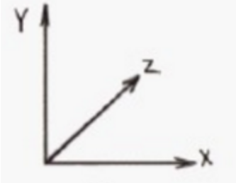

# hello, world

## asset store

asset store为unity的资源商店

在asset store中下载资源后,在unity中window-package manageer中导入

## 界面介绍

**2个视图**

scene: 编译游戏场景

game: 运行游戏

**3个窗口**

project: 资源库

hierarchy: 游戏对象的层级

inspector: 属性窗口, 查看/修改每个对象的属性

**4个栏位**

标题栏

菜单栏

工具栏

状态栏

# scene视图

## 在scene中移动

unity中的坐标系统

> 快捷键: 鼠标右键+wasd 以第一人称视角移动镜头