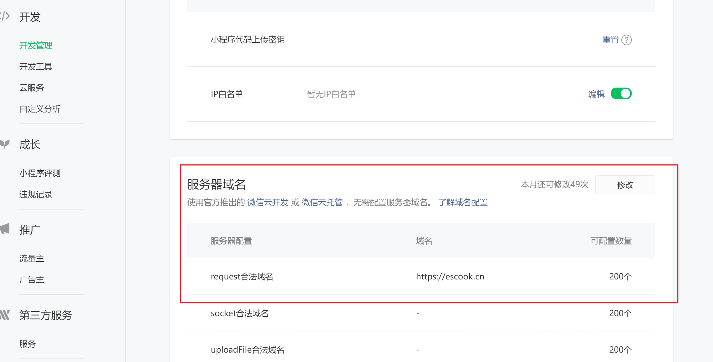
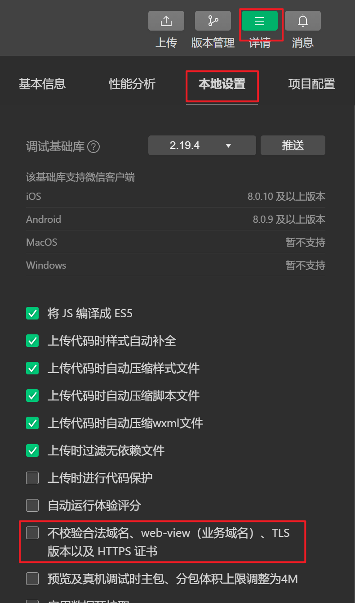
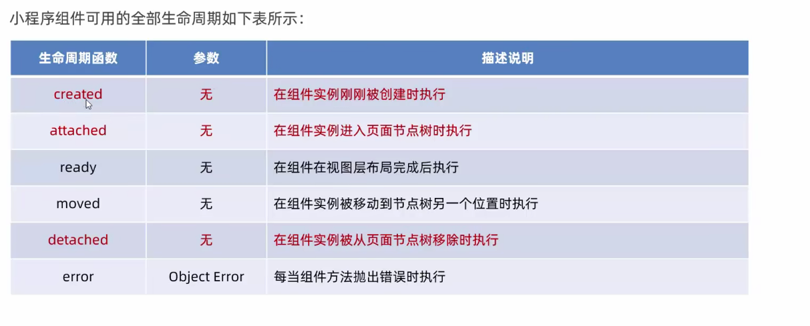

# helloworld

## 目录组成

- pages: 存放所有页面
- utils: 存放工具模块
- app.js: 项目入口文件
- app.json: 项目全局配置文件
- app.wxss: 全局样式文件
- project.config.json: 项目配置文件
- sitemap: 用来配置小程序是否允许被微信索引


## 页面

所有页面都存放在pages目录中, 一个页面为一个文件夹, 每个页面文件夹包含四个文件:

- `.js` 脚本文件
- `.json` 配置文件
- `.wxml` 相当于html标签结构文件
- `wxss` 相当于css样式文件, wxss的特有像素但未rpx,支持自适应


新建页面: 在app.json的pages中添加页面路径


## json

小程序中的四种json配置文件:

- `app.json`
- `project.config.json`, 为项目的个性化配置
- `sitemap.json`, 微信中的seo, 即配置小程序在微信中的索引
- `每个页面的.json`


**app.json**结构

```json
{
  "pages":[ // pages声明所有页面, 第一条路径代表首页路径
    "pages/index/index",
    "pages/logs/logs"
  ],
  "window":{ // 全局定义小程序页面的背景色,文字等
    "backgroundTextStyle":"light", // 下拉刷新load的样式
    "navigationBarBackgroundColor": "#fff",
    "navigationBarTitleText": "Weixin",
    "navigationBarTextStyle":"black"
  },
  "style": "v2", // 组件样式的版本
  "sitemapLocation": "sitemap.json" // 用于指定sitemap.json文件的位置
}
```


sitemap.jon结构

```json
{
  "desc": "关于本文件的更多信息，请参考文档 https://developers.weixin.qq.com/miniprogram/dev/framework/sitemap.html",
  "rules": [{ // 索引规则
  "action": "allow", // 允许索引, disallow表示不允许被索引
  "page": "*" // 所有页面
  }]
}
```


## js文件

- app.js: 小程序的入口文件,通过调用`App()`函数来启动小程序
- 页面中的js文件: 页面的入口文件,通过调用`Page()`函数来创建整个页面
- 普通js文件: 可以用来封装通用函数


## 宿主环境

微信小程序的宿主环境是微信客户端,该宿主环境为小程序提供了以下功能:

- 通信模型
- 运行机制
- 组件
- api


**通信模型**

小程序中的通信主体包含渲染层(wxml,wxss)和逻辑层(js脚本), 小程序的通信模型分为两种, 一种是渲染层和逻辑层之间的通信, 另一种是逻辑层和第三方服务器之间的通信, 这两种通信都是由微信客户端来进行转发的


## 运行机制

**小程序启动过程**

- 解析app.json文件
- 执行app.js中的App()函数
- 渲染首页


**页面渲染过程**

- 加载.json配置文件
- 加载.wxml和.wxss
- 执行.js文件中的Page()函数


# 组件


## 视图容器

- view: 块级元素

- scroll-view: 有滚动效果的view容器, 需要指定高度, 标签内属性`scroll-y`表示纵向滚动, `scroll-x`表示横向滚动

- swiper和swiper-item: 块级元素, 轮播图容器和轮播图item组件, 属性`indicator-dots`开启底部小圆点

> 块级元素的居中分散显示: `display: flex; justify-content: space-around; `

 

## 基础内容

**text**

行内元素, 用于填入文本, user-select表示是否可长按选中

```html
<text user-select="true">19836413928</text> 
```


 **rich-text**

行内元素, 可以渲染html标签

```html
<rich-text nodes="<h1>hello, world</h1>"/>
```


## 表单组件

**button**

```html
<button type="primary">一个按钮</button>
<button type="warn">一个按钮</button>
<button size="mini">一个按钮</button>
<button size="mini" plain>一个按钮</button> // plain表示是否有边框
```


**image**

mode为图片的显示方式

```html
<image src="../../images/space.jpg" mode="widthFix"></image>
```


# wxml模板语法

## 数据绑定

定义页面数据: 在页面.js文件的data对象中定义数据

```js
Page({
    data: {
        str: '哈哈哈',
    },
})
```


使用数据: 在wxml中使用`{{}}`来使用data中的数据

```html
<text>{{str}}</text>
```


## 事件绑定

常用事件:

- tap 点击事件
- input 输入事件
- change 状态改变事件


### bindtap

给按钮绑定点击事件

```html
<button type="primary" bindtap="getPhone">显示号码</button>
```


在.js中声明该事件函数, 与data配置项平级

```js
getPhone(e) {
    console.log(this.data.str); // 读取data中的数据
    this.setData({ // 修改data中的数据
        count: this.data.count + 1,
    })
},
```


### 事件传参

使用data-参数名的方式

```html
<button type="warn" bindtap="fun1" data-num='{{1}}'>事件传参</button>
```


在函数中使用e.target.dataset.参数名使用参数

```js
fun1(e) {
    console.log(e.target.dataset.num);
},
```


### bindinput

bindinput为当input框中的值发生变化时触发

```html
<input type="text" bindinput="getInput"/>
```


获取input框中的最新值

```js
getInput(e) {
    console.log(e.detail.value);
},
```


## 条件渲染

使用`vx:if`, `vx:else-if`, `vx:else`来实现条件渲染

使用`block`标签来充当包裹代码块, 即vue中的`template`标签


使用`hidden`属性来实现元素的隐藏与否


## 列表渲染

arr为数组

```html
<view wx:for="{{arr}}" wx:key="index">
    <text>{{index}}: {{item}}</text>
</view>
```


# wxss模板样式


## rpx

微信小程序中的响应式单位, 将所有屏幕的宽度分为750份, 每一份为1rpx


## 样式导入

在wxss文件中导入外部wxss文件

```
@import "common.wxss";
```


# 全局配置

在app.json中进行全局配置, 下面为app.jon中各结点的可选配置项

## window

- **navigationBarTitleText** 导航栏标题文本
- **navigationBarBackgroundColor** 导航栏背景色
- **navigationBarTextStyle** 导航栏标题颜色
- **enablePullDownRefresh** 是否全局开启下拉刷新
- **backgroundColor** 下拉刷新时窗口的背景色
- **backgroundTextStyle** 下拉刷新时加载小圆点的颜色, 只有light和dark两个选项
- **onReachBottomDistance** 设置上拉触底刷新的距离, 默认值为50(表示滚动条距离页面底部不足50px时刷新下一页的内容)


## tabBar

tabBar配置最少两个,最多五个, 且顶部tabBar无法配置icon图标

tabBar的六个组成部分:

- backgroundColor: tabBar的背景色
- selectIconPath: 选中时的图片路径
- iconPath: 未选中时的图片路径
- selectColor: 选中时的文字颜色
- color: 未选中时的文字颜色


示例:

```js
"tabBar": {
    "list": [
        {
            "pagePath": "pages/message/message",
            "text": "消息",
            "iconPath": "/images/message.png",
            "selectedIconPath": "/images/message-active.png"
        },
        {
            "pagePath": "pages/find/find",
            "text": "发现",
            "iconPath": "/images/find.png",
            "selectedIconPath": "/images/find-active.png"
        },
        {
            "pagePath": "pages/home/home",
            "text": "我",
            "iconPath": "/images/home.png",
            "selectedIconPath": "/images/home-active.png"
        }
    ],
    "selectedColor": "#00aeec"
}
```


# 网络请求


## 添加合法域名

小程序中的接口请求有以下限制:

- 只能请求https类型接口
- 必须将接口的域名添加到信任列表中

因此,想要访问某个接口,需要先在小程序后台进行配置添加request合法域名




在开发调试阶段也可以设置不验证合法域名




## request()

调用wx.request()方法来发起get或post请求

```js
getInfo() {
    wx.request({
        url: 'https://www.escook.cn/api/get',
        method: 'GET',
        data: this.data.p1,
        success: (res) => {
            const data = res.data
            console.log(data);
        }
    })
},
```


# 页面导航

## 声明式导航

```html
<navigator url="/pages/home/home" open-type="switchTab">跳转到home</navigator>
```

注意点: open-type表示要跳转到的页面的类型, switchTab表示要跳转到tabBar页面, navigate表示跳转到非tabBar页面


**后退**

```html
<navigator open-type="navigateBack" delta="1">后退</navigator>
```


导航传参, 使用在url后面拼接`?k1=v1&k2=v2`的形式


## 编程式导航

跳转到tabBar页面, 调用wx.switchTab方法

```js
wx.switchTab({
    url: '/pages/home/home'
})
```


跳转到非tabBar页面, 调用navigateTo方法

```js
wx.navigateTo({
    url: '/pages/home/home'
})
```


导航传参, 使用在url后面拼接`?k1=v1&k2=v2`的形式

注意: 导航传参传递给页面的参数会被`onload`函数的`option`参数接收


# 下拉刷新&上拉触底

## 下拉刷新

首先在页面的json文件中设置开启下拉刷新行为并设置样式

```json
{
    "usingComponents": {},
    "enablePullDownRefresh": true,
    "backgroundColor": "#efefef",
    "backgroundTextStyle": "dark"
}
```


在页面的js文件中的`onPullDownRefresh`方法专门监听下拉动作

```js
    onPullDownRefresh() {
        // 一些处理
        wx.stopPullDownRefresh();// 停止下拉刷新动作
    },
```


## 上拉触底

在页面的js文件中的`onReachBottom`方法专门监听上拉触底事件


# 生命周期函数

app.js中

- onShow 小程序从后台进入前台时触发
- onHide 小程序从前台进入后台时触发


# wxs

wxs即微信script, 使用wxs可以让我们在wxml中添加脚本


**内嵌wxs**

例如下例在wxml中定义一个将字符串转为大写显示的脚本并使用

```html
<text>{{m1.toUpper('origin')}}</text>

<wxs module="m1">
    module.exports.toUpper = function(str) {
        return str.toUpperCase();
    }
</wxs>
```


**外联wxs**

创建wxs文件

```js
function toLower(str) {
    return str.toLowerCase()
}

module.exports = {
    toLower: toLower
}
```


在需要使用的wxml中引入该wxs文件并指定模块名

```html
<wxs src="../../utils/tools.wxs" module="m1"/>
```


注意: 

- wxs中定义的方法大多数应用场景是配合`{{}}`当过滤器使用, 但不能作为事件的回调函数
- wxs不能调用js中的函数
- wxs不能调用小程序提供的api


# 自定义组件

根目录下的components文件夹下的每个目录就是一个自定义组件,其目录结构与页面相同,包含四个文件

组件与页面的区别:

- 组件.json文件中需要声明`"component": true`
- 组件.js文件中调用的是`Component()`函数
- 组件的事件处理函数需要定义到`methods`结点中


## 组件引用

在页面的json文件中局部引入自定义组件, 在wxml中使用标签的形式来使用自定义组件

在app.jon中全局引入组件, 使该组件可以被所有页面使用

```json
{
    "usingComponents": {
        "test": "/components/test/test"
    }
}
```


## 组件样式

app.wxss中的类名选择器对组件无效

组件样式默认是与外界隔离的, 但可以通过配置修改

```js
// .js文件中的options结点
options: {
    styleIsolation: 'isolated' // 默认值, 表示样式隔离
},
```

> styleIsolation的可选值: 
>
> - isolated: 样式隔离
> - apply-shared: 外部样式能够作用与组件, 但组件样式不作用与外界
> - page-apply-shared: 组件和页面能够双向影响


## properties

properties用于接收外部传递给组件的数据,在.js文件声明`properties`结点, 该结点内声明的数据, 外部就可以传入

```js
properties: {
    max: { // 完整写法
        type: Number, // 数据类型
        value: 10 // 默认值
    },
    min: Number // 简写形式
},
```


## 监听器

在组件js文件中声明observes结点, 在其内配置要监听的数据的监听函数

```js
observers: {
    'n1, n2': function(newN1, newN2) {
        this.setData({
            sum: newN1 + newN2
        })
    }
},
```

> 要监听的对象也可以写成'对象.属性a, 对象.属性b'
>
> '对象.**'表示监听该对象的所有属性


## 纯数据字段

即不参与页面渲染,也不传递给其他页面的数据

在组件js文件中的options结点中声明纯数据字段的正则表达式

```json
options: {
    pureDataPattern: /^_/
},
```


## 组件生命周期函数



**created**: 此时无法调用setData

**attached**: this.data初始化完成


在组件.js文件中的lifetimes结点中声明周期函数

```js
lifetimes: {
    created() {

    },
    attached() {

    }
}
```


## 组件所在页面生命周期函数

即组件所在的页面的状态发生变化时的钩子, 声明在组件js文件的`pageLifetimes`结点中

可选钩子:

- **show**: 页面被显示
- **hide**: 页面被隐藏
- **resize**: 页面尺寸变化


## 插槽

即`slot`标签, 默认只支持单插槽

多插槽配置:

在.js文件的options结点中进行声明

```js
options: {
    multipleSlots: true
},
```

定义多插槽, 使用name属性来标识不同的插槽

使用多插槽, 使用slot属性来指定插槽


## 组件通信


### 属性绑定

用于实现父组件向子组件传值

具体操作:

在父组件中向子组件标签中传入数据

```html
<test count="{{100}}"></test>
```

在子组件js文件properties结点中声明要接收的数据

```js
properties: {
    count: Number
},
```


### 事件绑定

通过绑定自定义实现实现子组件向父组件传递数据, 原理同vue中对应内容,都是父组件向子组件提供一个修改数据的函数, 子组件恰当位置调用该函数,并将自身数据作为参数传入

具体实现:

父组件js文件中定义数据修改函数

```js
// 这个函数将来会被声明为一个自定义事件函数, 因此会接收到一个事件对象e,e.detail为外部传递过来的参数
syncCount(e) { 
    this.setData({
        count: e.detail.value
    })
},
```


父组件wxml中给子组件标签声明自定义事件函数

```html
<test bind:sync="syncCount"></test> // bind:开头表示自定义事件, sync为事件名
```


在子组件js文件中触发自定义事件, 传入事件名, 参数配置对象

```js
this.triggerEvent('sync', {value: this.data.count})
```


### 获取组件实例

在父组件中给子组件标签提供`class`属性后, 就可以通过`const c = this.selectComponent('类名选择器或id选择器')`来获取子组件的对象实例,进而调用`c.setData({})`等来操作子组件中的数据


## behaviors

behaviors用于数据共享

单独创建一个js文件来定义一个behaviors并暴露

```js
module.exports = Behavior({
    data: {},
    properties: {},
    methods: {},
    behaviors: []
})
```


在组件js文件的最开头引入behavior, 并在behaviors结点中进行声明

```js
// components/test/test.js
const myBehaviors = require('../../behaviors/my-behaviors')
Component({
    behaviors: {
        'myBehaviors': myBehaviors
    },
})
```


# 全局数据共享

相关npm依赖:

`mobx-miniprogram`: 创建store实例对象

`mobx-miniprogram-bindings`: 把store中的共享数据或方法绑定到组件或页面中使用


定义store, 创建store.js文件

```js
import { observable, action } from 'mobx-miniprogram'

export const store = observable({
    numA: 1,
    numB: 2,
    get sum() { // 计算属性, 使用get修饰
        return this.numA + this.numB
    },
    // action函数, 用于配置修改store中数据的方法
    updateNumA: action(function(addNum) {
        this.numA += addNum
    }),
    updateNumB: action(function(addNum) {
        this.numB += addNum
    })
})
```


在页面中绑定store中的数据和actions

```js
import { createStoreBindings } from 'mobx-miniprogram-bindings'
import { store } from '../../store/store'

Page({
    onLoad(options) {
        this.storeBindings = createStoreBindings(this, {
            store,
            fields: ['numA', 'numB', 'sum'],
            actions: ['updateNumA', 'updateNumB']
        }) 
    },

    onUnload() {
        this.storeBindings.destroyStoreBindings()
    },
})
```


在组件js文件中绑定store中的数据和actions

```js
import { storeBindingsBehavior } from 'mobx-miniprogram-bindings'
import { store } from '../../store/store'
Component({
    behaviors: [storeBindingsBehavior],
    storeBindings: {
        store,
        fields: {
            numA: 'numA',
            numB: 'numB',
            sum: 'sum'
        },
        actions: {
            updateNumA: 'updateNumA'
        }
    },
})

```


# 分包

在app.json文件中配置子包结点`subPackages`

```js
"subPackages": [ // 数组内每个对象为一个子包
    {
        "root": "pksA", // 子包根目录
        "name": "p1", // 子包别名
        "pages": [ // 子包下的页面
            "pages/cat/cat", 
            "pages/dog/dog"
        ]
    },
    {
        "root": "pkgB",
        "name": "p2",
        "pages": [
            "pages/apple/apple",
            "pages/banana/banana"
        ],
        "independent": true // 声明为独立分包
    }
],
```


每个分包可分为页面和资源两个部分, 资源的引用原则是:

- 主包无法引用分包内的私有资源
- 分包之间不能相互引用私有资源
- 分包可以引用主包内的资源


**独立分包**

默认情况下,用户打开小程序后,默认启动主包,显示tabBar, 然后通过主包访问其他子包, 即不能直接访问子包

独立分包为可以不用通过主包而直接访问的包, 独立分包与其他包之间是相互隔离的,不能相互引用


**分包预下载**

指当进入某一页面后预加载某些其他分包, 在app.json中的`preloadRule`结点中进行配置

```js
"preloadRule": {
    "pages/contact/contact": {// 当进入contact页面后
        "packages": ["p1"], // 预加载p1分包
        "network": "all" // 在所有网络下都允许预加载, 可选值还有`wifi`, 表示只在wifi环境下预加载
    }
}
```


