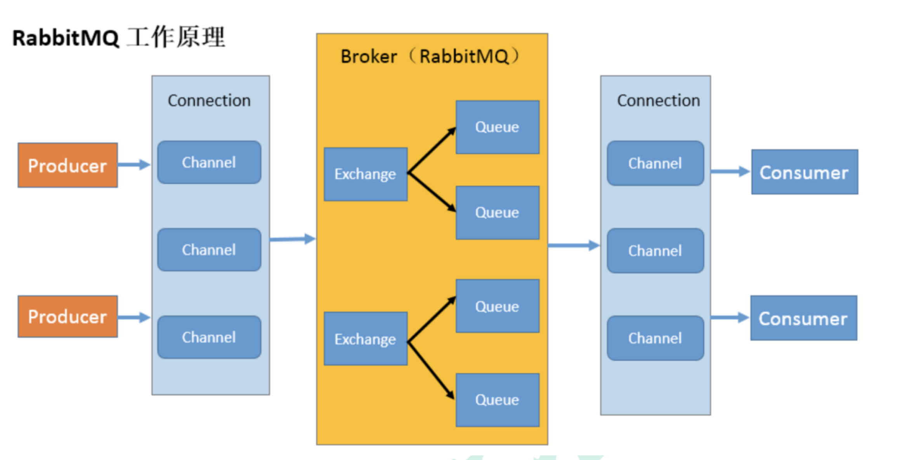
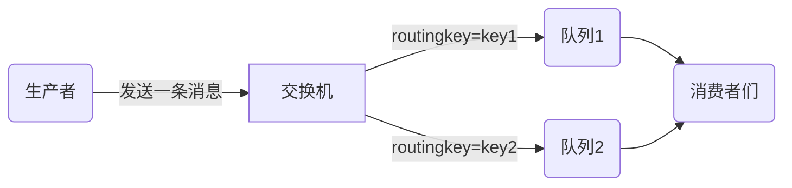

# 概述

MQ全程message queue,即消息队列

rabbitMQ是众多消息队列之一

rabbitmq的四大核心:

- **生产者**: 产生数据发送消息的程序
- **交换机**: 接收来自生产者的消息,将消息推送到队列中
- **队列**: 主机内存中的消息缓存区,存储消息的数据结构
- **消费者**: 等待接收消息的程序


工作原理图




# hello, world

生产者: 使用工厂创建一个连接,在连接中创建信道,通过信道创建并连接到队列,然后通过信道向队列中发送消息

消费者: 使用工厂创建一个连接,在连接中创建信道, 通过信道连接到指定队列,获取该队列中的消息


生产者

```java
public class Producer {
    // 队列名称
    private String QUEUE_NAME;

    public Producer(String QUEUE_NAME) {
        this.QUEUE_NAME = QUEUE_NAME;
    }
	
    // 发送消息方法
    public void send(String message) throws IOException, TimeoutException {
        // 创建连接工厂
        ConnectionFactory factory = new ConnectionFactory();
        factory.setHost("192.168.26.155");
        factory.setUsername("admin");
        factory.setPassword("123");
        // 使用工厂创建连接
        Connection connection = factory.newConnection();
        // 使用连接来创建信道
        Channel channel = connection.createChannel();
        // 使用信道生成并连接到队列
        // 参数列表:
        // 1. 队列名称
        // 2. 是否消息持久化, 即消息是保存到内存还是磁盘中
        // 3. 是否独享消息, 独享意味着只有一个消费者能获取该队列中的消息
        // 4. 是否自动删除, 即最后一个消费者断开连接后,该队列是否自动删除
        channel.queueDeclare(QUEUE_NAME, false, false, false, null);
        // 通过channel发送消息到队列中
        // 参数列表
        // 1. 发送到哪个交换机
        // 2. 路由key
        // 3. 其他参数信息
        // 4. 要发送的消息体
        channel.basicPublish("", QUEUE_NAME, null, message.getBytes());
        System.out.println("消息发送成功");
    }
}
```


消费者

```java
public class Consumer {
    private String QUEUE_NAME;

    public Consumer(String QUEUE_NAME) {
        this.QUEUE_NAME = QUEUE_NAME;
    }
	
    // 接收消息方法
    public void consume() throws IOException, TimeoutException {
        // 创建连接工厂
        ConnectionFactory factory = new ConnectionFactory();
        factory.setHost("192.168.26.155");
        factory.setUsername("admin");
        factory.setPassword("123");
        // 使用工厂创建连接
        Connection connection = factory.newConnection();
        Channel channel = connection.createChannel();
        // 从队列中获取消息
        // 参数列表:
        // 1. 要消费的队列名称
        // 2. 消费成功后是否自动应答
        // 3. 消费消息的回调函数
        // 4. 接收消息失败的回调函数
        channel.basicConsume(QUEUE_NAME, true, (c, d) -> {
            System.out.println(new String(d.getBody()));
        }, (c) -> {
            System.out.println("消息被中断");
        });
    }
}

```


**核心方法**

声明队列

```java
channel.queueDeclare(队列名称, 是否为持久化队列, 是否为独享队列, 是否自动删除队列, 声明队列的其他属性的map);
```


发送消息,这里的交换机名称使用空串`""`表示默认交换机,如果使用默认交换机,则routingkey默认为队列名

```java
channel.basicPublish(交换机名称, routingkey, 消息的其他属性, 要发送的消息的消息体的字节数组);
```


接收消息

```java
channel.basicConsume(队列名称, 是否自动应答消息, 成功接收消息的回调, 取消接收消息的回调);
```


# work queues

work queues即工作队列,表示只有一个队列的消息队列模型

## 轮训分发

将一个消费者看作一个工作线程,work queues指多个工作线程同时通过信道从队列中接收消息,从而提高处理消息的效率

因为有多个线程同时处理消息, 为了避免同一个消息的重复处理,work queus要求一个消息只能被处理一次,因此work queus采用轮训分发消息模式,即同一个工作线程不连续接收两条消息,多个工作线程轮流接收处理消息


## 消息应答

消息应答即消费者在成功接收消息并成功处理后,再向rabbitmq传达可以删除消息的信号,防止消费者处理消息时发生异常从而造成消息丢失

具体做法为,在接收消息时,设置自动应答为false

```java
channel.basicConsume(QUEUE_NAME, false, deliverCallback, cancelCallback);
```


然后在deliverCallback中进行手动应答,调用basicACK方法

```java
DeliverCallback deliverCallback = (consumerTag, delivery) -> {
    byte[] bodyByByte = delivery.getBody();
    String message = new String(bodyByByte);
    long deliveryTag = delivery.getEnvelope().getDeliveryTag();// 获取消息的key
    // 手动确认消息,传入消息的key和是否批量应答
    channel.basicAck(deliveryTag, false);
};
```


这样一来,只要不调用ack方法,那么队列中的对应消息就不会被删除,且rabbitmq会自动将未确认的消息再次发送给下一个工作线程去处理


## 持久化

队列持久化: 在声明队列时(queueDeclare)指定为持久化队列[^1],持久化队列在重启rabbitmq服务后仍在存在

消息持久化: 在发布消息时(basicPublish)指定为持久化消息`channel.basicPublish("", QUEUE_NAME, MessageProperties.PERSISTENT_TEXT_PLAIN, message.getBytes());`


[^1]: 队列声明后其属性不可再修改,否则会报错,如果想修改队列声明,例如把非持久化队列修改为持久化队列,需要先删除原队列,再重新声明队列


## 不公平分发

即非轮训分发,而是看哪个工作线程处于相对空闲状态就将消息分发给哪个线程

工作线程有一个方法, `channel.basicQos(int prefetch)` 该方法传入一个整数,称为预取值, 表示该消费者channel所能承担的消息数量,例如`channel.basicQos(5)`表示设置该channel一次至多同时发送5条消息给工作线程

默认值为0,表示公平分发(轮训分发)

举例: a工作线程设置预取值5,b工作线程设置预取值2,此时有10条待接收消息,则可能的情况是,a工作线程的channel处堆积5条消息,b工作线程的channel处堆积2条消息,b工作线程处理完后,再次接收两条消息,最后一条消息被a工作线程获取


# 发布确认

设置消息的持久化就是将消息保存在磁盘中,但是这一步也可能会出异常,因此考虑当rabbitmq成功将消息保存在磁盘上后向生产者发送**发布确认**以确认持久化消息成功

具体操作: 

1. 给生产者的channel设置`channel.confirmSelect();`开启发布确认
2. 发布完消息后调用`boolean isConfirm = channel.waitForConfirms();`等待发布确认,返回值为true表示成功发布

发布确认的几种方式:

- **单个发布确认**: 一种同步确认发布方式,发布一个消息之后,只有当该消息被确认发布后,才能再次发送下一条消息,即发送一条消息,就调用一次`waitForConfirms()`
- **批量确认**: 累计发送多条消息后确认一次, 即发送n条消息后,调用一次`waitForConfirms()`
- **异步批量确认**: 发布消息后不等待消息的确认,而是单独开启独立线程去确认消息


异步批量确认举例

```java
// 获取信道
Channel channel = RabbitMqUtils.getChannel();
// 声明队列
channel.queueDeclare(QUEUE_NAME, true, false, false, null);
// 开启发布确认
channel.confirmSelect();
// 创建一个集合来存储发送但未发布确认的消息
ConcurrentSkipListMap<Long, String> messages = new ConcurrentSkipListMap<>();
// 确认收到消息的回调
ConfirmCallback ackCallback = (deliveryTag, multiple) -> {
    if (multiple) { // 是否为批量发布消息
        // 返回小于等于当前序列号的消息
        ConcurrentNavigableMap<Long, String> notConfirmed = messages.headMap(deliveryTag, true);
        // 将这些消息清除
        notConfirmed.clear();
    } else {
        // 清除当前序列号消息
        messages.remove(deliveryTag);
    }
};
// 未确认收到消息的回调
ConfirmCallback nackCallback = (deliveryTag, multiple) -> {
    String nackMessage = messages.get(deliveryTag);
    System.out.println("发布的消息" + nackMessage + "未被确认, 序列号" + deliveryTag);
};
// 添加异步确认监听器
channel.addConfirmListener(ackCallback, nackCallback);
// 发送消息
for (int i = 0; i < 100; i++) {
    // 获取下一条要发送的消息的key,自动生成,从1开始自增长
    long No = channel.getNextPublishSeqNo();
    // 将消息添加至集合中
    messages.put(No, message);
    // 发布消息
    channel.basicPublish("", QUEUE_NAME, null, message.getBytes());
}
```


# 交换机

上面的工作队列模型中,队列只有一个,因此无需考虑交换机,使用的是默认交换机,在发布消息的代码中`channel.basicPublish(交换机名称, routingkey, 消息的其他属性, 要发送的消息的消息体的字节数组);`交换机名称处填入空串`""`表示使用默认交换机,使用默认交换机时,routingkey默认就为队列名称

当有多个队列时,就需要使用非默认交换机了,此时模型如下:




生产者只负责将消息发送给交换机,由交换机决定如何发送消息,例如发送给多个队列或只发送给一个队列,这些规则由交换机的类型来决定,交换机类型的取值有:`direct`, `topic`, `headers`, `fanout`

交换机通过routingkey来区分不同的队列,这个动作也叫交换机与队列间的绑定

代码示例:

```java
// 创建信道
Channel channel = RabbitMqUtils.getChannel();
// 声明交换机(交换机名称, 交换机类型)
channel.exchangeDeclare(exchangeName, "fanout");
// 生成临时队列
String queueName = channel.queueDeclare().getQueue();
// 绑定交换机和队列,fanout类型的交换机, 默认会将消息发布给所有的消费者,因此routingKey为""就好
channel.queueBind(queueName, exchangeName, "");
// 发布消息
channel.basicPublish(exchangeName, "", null, message.getBytes());
```


几种交换机类型:

**fanout**: 默认将消息发送给所有消费者

**direct**: 可以将消息发送给指定的消费者

**topic**: 可以将消息发给指定的任意个消费者,通过routingKey来进行匹配,routingKey的命名有一定的规则:多个单词间用`.`分割,例如`quick.origin.rabbit`,且有两个通配符,`*`表示任意一个单词,`#`表示0个或任意个单词


# 死信队列

死信指的是消费失败的消息,例如消息ttl过期, 队列达到最大长度, 消息被拒绝等

为了保证消息不丢失,考虑设置一个死信队列,专门用于存放死信,并设置一个专门处理死信的消费者

 

实例: 模拟消息ttl过期导致消息进入死信队列

生产者,发送带有ttl的消息

```java
Channel channel = RabbitMqUtils.getChannel();
// 创建用于配置消息数学的properties, 设置消息的ttl
AMQP.BasicProperties properties = new AMQP.BasicProperties().builder().expiration("100000").build();
channel.exchangeDeclare(EXCHANGE_NAME, BuiltinExchangeType.DIRECT);
while (true) {
    Scanner scanner = new Scanner(System.in);
    String message = scanner.next();
    channel.basicPublish(EXCHANGE_NAME, "key1", properties, message.getBytes("utf8"));
}
```


消费者

```java
Channel channel = RabbitMqUtils.getChannel();

// 声明死信交换机
channel.exchangeDeclare(DEAD_EXCHANGE_NAME, BuiltinExchangeType.DIRECT);
// 声明死信队列
channel.queueDeclare(DEAD_QUEUE_NAME, false, false, false, null);
// 绑定死信队列与死信交换机
channel.queueBind(DEAD_QUEUE_NAME, DEAD_EXCHANGE_NAME, "dead");

// 声明普通交换机
channel.exchangeDeclare(EXCHANGE_NAME, BuiltinExchangeType.DIRECT);
// 声明普通队列,并被该普通队列设置死信交换机,map中的key为固定值
HashMap<String, Object> params = new HashMap<>();
params.put("x-dead-letter-exchange", DEAD_EXCHANGE_NAME);
params.put("x-dead-letter-routing-key", "dead");
channel.queueDeclare(QUEUE_NAME, false, false, false, params);
// 绑定普通队列与普通交换机
channel.queueBind(QUEUE_NAME, EXCHANGE_NAME, "normal");
// 消费消息
DeliverCallback deliverCallback = (consumerTag, delivery) -> {
    String message = new String(delivery.getBody(), "utf8");
    System.out.println("收到的消息: " + message);
};
channel.basicConsume(QUEUE_NAME, true, deliverCallback, consumerTag -> {});
```


死信队列消费者

```java
Channel channel = RabbitMqUtils.getChannel();
DeliverCallback deliverCallback4Dead = (consumerTag, delivery) -> {
    String message = new String(delivery.getBody(), "utf8");
    System.out.println("收到的消息: " + message);
};
channel.basicConsume(DEAD_QUEUE_NAME, true, deliverCallback4Dead, consumerTag -> {});
```


**消息拒收**

当队列开启手动应答后,就可以拒收消息,被拒收的消息通常也放入死信队列

调用`basicReject(消息的key, 是否重新放入原队列)`方法来拒收消息

```java
channel.basicReject(delivery.getEnvelope().getDeliveryTag(), false);
```


# springBoot整合RabbitMQ

相关依赖

```xml
<dependency>
    <groupId>org.springframework.boot</groupId>
    <artifactId>spring-boot-starter-amqp</artifactId>
 </dependency>
<dependency>
    <groupId>org.springframework.amqp</groupId>
    <artifactId>spring-rabbit-test</artifactId>
    <scope>test</scope>
 </dependency>
```


配置文件

```yaml
spring:
  rabbitmq:
    host: 192.168.26.160
    port: 5672
    username: admin
    password: 123
```


配置类:在springboot中使用rabbitmq时,所有的队列,交换机都统一声明在配置类中

```java
@Configuration
public class MQConfig {
    // 常量声明
    public static final String NORMAL_EXCHANGE = "normal_exchange";
    public static final String DEAD_LETTER_EXCHANGE = "dead_letter_exchange";
    public static final String QUEUE1 = "queue1";
    public static final String QUEUE2 = "queue2";
    public static final String DEAD_LETTER_QUEUE = "dead_letter_queue";
    public static final String DEAD_LETTER_ROUTING_KEY = "dead";
    public static final String QUEUE1_TO_NORMAL_EXCHANGE_ROUTING_KEY = "queue1_to_normal_exchange_routing_key";
    public static final String QUEUE2_TO_NORMAL_EXCHANGE_ROUTING_KEY = "queue2_to_normal_exchange_routing_key";
    public static final Long MESSAGE_TTL_10S = 10000L;
    public static final Long MESSAGE_TTL_20S = 20000L;

    // 声明交换机,返回类型例如DirectExchange
    @Bean
    public DirectExchange normalExchange() {
        return new DirectExchange(NORMAL_EXCHANGE);
    }

    @Bean
    public DirectExchange deadLetterExchange() {
        return new DirectExchange(DEAD_LETTER_EXCHANGE);
    }

    // 声明队列, 使用QueueBuilder类
    @Bean
    public Queue queue1() {
        HashMap<String, Object> params = new HashMap<>();
        params.put("x-dead-letter-exchange", DEAD_LETTER_EXCHANGE);
        params.put("x-dead-letter-routing-key", DEAD_LETTER_ROUTING_KEY);
        params.put("x-message-ttl", MESSAGE_TTL_10S);
        return QueueBuilder.durable(QUEUE1).withArguments(params).build();
    }

    @Bean
    public Queue queue2() {
        HashMap<String, Object> params = new HashMap<>();
        params.put("x-dead-letter-exchange", DEAD_LETTER_EXCHANGE);
        params.put("x-dead-letter-routing-key", DEAD_LETTER_ROUTING_KEY);
        params.put("x-message-ttl", MESSAGE_TTL_20S);
        return QueueBuilder.durable(QUEUE2).withArguments(params).build();
    }

    @Bean
    public Queue deadQueue() {
        return QueueBuilder.durable(DEAD_LETTER_QUEUE).build();
    }

    // 绑定队列和交换机, 使用BindingBuilder类
    @Bean
    public Binding queue1BindingNormalExchange(@Qualifier("queue1") Queue queue1,
                                               @Qualifier("normalExchange") DirectExchange normalExchange) {
        return BindingBuilder.bind(queue1).to(normalExchange).with(QUEUE1_TO_NORMAL_EXCHANGE_ROUTING_KEY);
    }

    @Bean
    public Binding queue2BindingNormalExchange(@Qualifier("queue2") Queue queue2,
                                               @Qualifier("normalExchange") DirectExchange normalExchange) {
        return BindingBuilder.bind(queue2).to(normalExchange).with(QUEUE2_TO_NORMAL_EXCHANGE_ROUTING_KEY);
    }

    @Bean
    public Binding deadQueueBindingDeadExchange(@Qualifier("deadQueue") Queue deadQueue,
                                                @Qualifier("deadLetterExchange") DirectExchange deadLetterExchange) {
        return BindingBuilder.bind(deadQueue).to(deadLetterExchange).with(DEAD_LETTER_ROUTING_KEY);
    }
}
```

> 初见:
>
> 1. new DirectExchange(交换机名称)/new TopicExchange(交换机名); // 创建四种交换机对象
>
> 2. QueueBuilder.durable(队列名).withArguments(其他参数).build(); // 声明队列,其他参数可省略 
> 3. BindingBuilder.bind(队列名).to(交换机名).with(routingKey); // 绑定交换机和队列


使用接口来扮演生产者

```java
@Slf4j
@RestController
@RequestMapping("ttl")
public class MessageController {
    // 通过RabbitTemplate类来发消息
    @Resource
    private RabbitTemplate rabbitTemplate;

    @GetMapping("sendMessage/{message}")
    public void send(@PathVariable("message") String message) {
        log.info("当前时间: {}, 发送一条消息给queue1和queue2: {}", new Date().toString(), message);
        // convertAndSend方法表示将java对象转为rabbit中的message对象后发送
        rabbitTemplate.convertAndSend(MQConfig.NORMAL_EXCHANGE, MQConfig.QUEUE1_TO_NORMAL_EXCHANGE_ROUTING_KEY,
                "来自queue1的消息 " + message);
        rabbitTemplate.convertAndSend(MQConfig.NORMAL_EXCHANGE, MQConfig.QUEUE2_TO_NORMAL_EXCHANGE_ROUTING_KEY,
                "来自queue2的消息 " + message);
    }
}
```

> 初见:
>
> 1. private RabbitTemplate rabbitTemplate; // rabbitmq中发送消息的对象
> 2. rabbitTemplate.convertAndSend(交换机名称, routingKey, 消息体); // 发送消息方法


消费者, 通过`@RabbitListener`注解标注一个监听方法,消费指定队列

```java
@Slf4j
@Component
public class DeadLetterQueueConsumer {
    
    @RabbitListener(queues = MQConfig.DEAD_LETTER_QUEUE)
    public void receiveFromDeadLetterQueue(Message message, Channel channel) {
        String messageStr = new String(message.getBody());
        log.info("当前时间：{},收到死信队列信息{}", new Date().toString(), messageStr);
    }
}
```


# 延迟队列

上文提到消息的ttl过期会使消息进入死信队列,然后被死信队列的消费者消费,如果我们故意让消息过期,即不在普通队列中应答消息,而是刻意让消息在等待一段时间后进入死信队列后再处理,这就是延迟队列,例如上面的springboot整合rabbitmq案例就是一个延迟队列

简单来说,延迟队列模型中的消息会等待一定的时间之后再被处理


处理方式1: 生产者发送消息时指定该条消息的ttl

```java
@GetMapping("sendMessage/{message}/{ttl}")
public void send(@PathVariable("message") String message, @PathVariable("ttl") String ttl) {
    rabbitTemplate.convertAndSend(EXCHANGE_NAME, ROUTING_KEY, message, msg -> {
        msg.getMessageProperties().setExpiration(ttl);
        return msg;
    });
}
```

> 初见:
>
> rabbitTemplate.convertAndSend(交换机名, routingKey, message, MessagePostProcessor);
>
> 此处的MessagePostProcessor是一个函数式接口,用于给message设置一些参数,例如ttl等

这种方式存在弊端, 因为RabbitMQ只会检查第一个消息是否过期, 如果过期则丢到死信队列, 如果第一个消息的延时时长很长, 而第二个消息的延时时长很短，第二个消息并不会优先得到执行。


# 发布确认

springboot中实现发布确认,有两个环节,一是交换机处的发布确认,二是队列处的发布确认(实际上是交换机路由确认)


配置文件

```yaml
spring:
  rabbitmq:
    publisher-confirm-type: correlated # 开启交换机处的发布确认
    publisher-returns: true # 当交换机路由失败时将消息回退给生产者
```

> publisher-confirm-type的可选值: 
>
> - NONE: 禁用发布确认
> - CORRELATED 交换机成功接收到消息后触发回调方法
> - SIMPLE


回调接口类: 声明两个环节的发布确认回调接口

```java
@Component
@Slf4j
public class MyCallback implements RabbitTemplate.ConfirmCallback, RabbitTemplate.ReturnsCallback {

    @Resource
    private RabbitTemplate rabbitTemplate;

    @PostConstruct // PostConstruct标注的方法当类加载完成后调用
    public void init() {
        rabbitTemplate.setConfirmCallback(this);
        rabbitTemplate.setReturnsCallback(this);
    }


    // 交换机处的发布确认回调
    @Override
    public void confirm(CorrelationData correlationData, boolean ack, String cause) {
        if (ack) {// 交换机成功接收到消息
            log.info("交换机成功接收到消息, id = {}", correlationData.getId());
        } else {// 交换机接收消息失败
            log.info("交换机接收消息失败, id = {}, 原因: {}", correlationData.getId() ,cause);
        }
    }

    // 交换机路由时的发布确认回调
    @Override
    public void returnedMessage(ReturnedMessage returned) {
        String message = new String(returned.getMessage().getBody());
        log.info("消息`{}`路由失败, 已退回", message);
    }
}
```

> 初见:
>
> 1. RabbitTemplate.ConfirmCallback接口的confirm方法, 无论交换机是否成功接收到消息,都会调用, 区别是成功接收到消息时,ack参数为true, 接收消息失败时, ack参数为false
> 2. RabbitTemplate.ReturnsCallback接口的returnedMessage方法, 只有当交换机路由失败(队列接收消息失败)时才会调用


生产者

````java
CorrelationData correlationData = new CorrelationData("1");
rabbitTemplate.convertAndSend(EXCHANGE_NAME, ROUTING_KEY, message, correlationData);
````


# 备份交换机

备份交换机是对无法路由的消息的一种处理机制, 当发现无法路由的消息时,将该消息发送给备份交换机,再发送给备份交换机的绑定队列, 备份交换机通常会绑定两个队列,一是备份队列,二是警告队列

具体操作: 声明交换机时使用`alternate`方法为其声明备份交换机

```java
@Bean
public DirectExchange normalExchange() {
    return ExchangeBuilder.directExchange(NORMAL_EXCHANGE)
        .durable(true).alternate(BACKUP_EXCHANGE).build();
}
```


