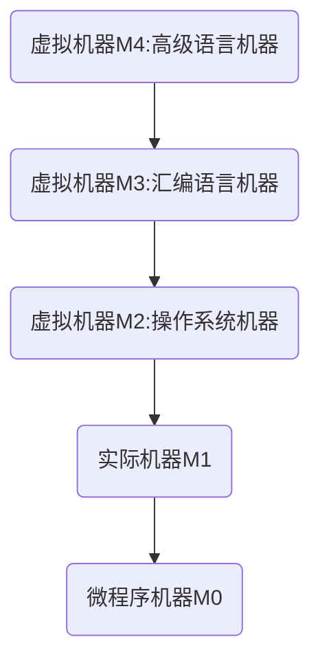

#  一. 计算机系统概论

## 1.1 计算机系统简介

**硬件和软件**

计算机系统由硬件和软件组成

软件分为系统软件和应用软件

**计算机系统的层次结构**

**机器语言**: 只用二进制0和1编写的程序,可以直接在实际机器M1上执行

**汇编语言**: 用符号来代替操作的语言(例如用ADD表示加号),汇编语言无法直接在实际机器上执行,必须由系统软件中的汇编程序来讲汇编语言翻译为机器语言后再在实际机器上执行,这里的汇编程序可以看成虚拟机M2

**高级语言**: 例如c语言,高级语言也无法直接在实际机器M1上执行,需要经过 高级语言->汇编语言->机器语言 或者 高级语言->机器语言 这一翻译过程, 这些工作由虚拟机M3完成

**翻译程序**: 将高级语言翻译为机器语言的软件成为翻译程序,翻译程序分为*编译程序*[^1]和*解释程序*[^2]

**微程序机器**: 实际机器M1向上可以延申出虚拟机M2, M3等,也可以向下延申出微程序机器M0,M0将M1中的每一条机器指令转为一个微程序解释并执行

**操作系统**: 在M1和M2之间还存在一个虚拟机器,即操纵系统,操作系统提供了汇编语言和高级语言在使用和操作中的基本操作,同时管理计算机的硬件和软件资源

**总结**: 硬件的研究对象为M1和M0,上层的虚拟机为软件的研究对象,本书主要讨论M1和M0

[^1]: 将源程序一次性全部翻译为机器语言
[^2]: 将源程序逐语句翻译为机器语言

## 1.2 计算机的基本组成

