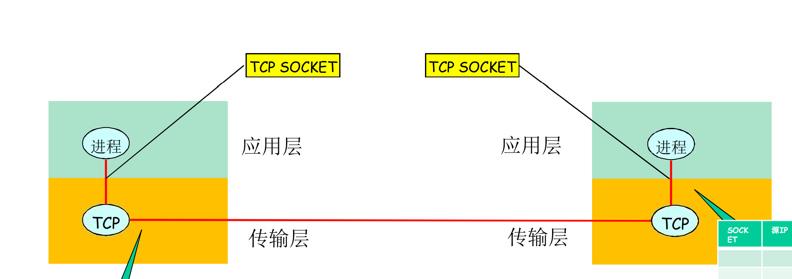

# 1 应用层

## 1.1 应用层协议原理

### 1.1.1 网络应用程序体系结构

- 客户-服务器模式(client/server)
- 对等模式(p2p: peer to peer)
- 混合体: c/s和p2p混合使用

### 1.1.2 进程通信

**socket**: 应用层与运输层之间的接口

**tcp/udp**: 运输层协议

**ssl**(Secure Sockets Layer): ssl实现于应用层,用于加强tcp的安全性, 当使用ssl时, 发送端进程向处于应用层ssl的传递明文数据, ssl将该数据加密后传递给发送端tcp, 发送端tcp将密文传送给接收方tcp, 接收方tcp将密文传递给接收端ssl进行解密, 最终ssl将解密明文传递给接收端进程 

## 1.2 web和http

http协议基于tcp连接

### 1.2.1 非持续连接和持续连接

**非持续连接**: 每个请求响应对经由一个单独的tcp连接发送

**持续链接**: 所有的请求响应经由相同的tcp连接发送

### 1.2.2 web缓存

每次发送请求时, 浏览器先创建与缓存服务器的tcp连接, 如果缓存中存在被请求对象则直接响应给浏览器,如果不存在则缓存服务器建立与原目标服务器的tcp连接, 从原服务器获取数据, 然后再响应给浏览器

**条件get请求**

用于解决缓存中的数据可能已经过期的问题. http响应报文中通常会包含`Last-Modified: `响应头, 标识了该请求对象最后一次被修改的日期, 此时, 可以发送一个条件get请求, 即请求头中包含`If-modified-since: `请求头, 该请求头的值就是上一次响应头中的`Last-Modified:`,如果请求对象的实际最后修改时间晚于该值,则说明请求对象已更新, 原服务器将发送新的请求对象给缓存服务器, 否则说明无需更新, 则原服务器响应体为空

## 1.3 电子邮件

### 1.3.1 SMTP

邮件发送流程: 邮件发送方用户代理将邮件发送给发送方对应的邮件服务器, 发送方邮件服务器通过SMTP协议将邮件发送给接收方邮件服务器, 接收方邮件服务器中含有接收方的邮箱, 邮件发送至接收方邮箱中

邮件接收流程: 接受方可随时通过用户代理从接受方的邮件服务器中接受方对应的邮箱中获取邮件

smtp属于邮件服务器之间的协议

### 1.3.2 邮件访问协议

SMTP协议是一种推协议, 例如用户代理将邮件推送给邮件服务器,而邮件访问则是用户代理从邮件服务器拉取邮件,是一种拉协议,即邮件访问协议,常见的邮件访问协议:

- POP3
- IMAP

## 1.4 DNS

dns包含: 

- 由分层的dns服务器实现的分布式数据库
- 使得主机能够访问这个数据库的应用层协议, 即DNS协议, DNS协议基于udp

dns运作流程: 

1. 用户主机上运行dns客户端
2. 用户使用浏览器发送请求`www.baidu.com`, 浏览器将该url发送给dns客户端
3. dns客户端向某个dns服务器获取该url对应的ip地址

### 1.4.1 分布式, 层次数据库

dns使用了大量的dns服务器, 以层次方式组织

有三中类型的nds服务器:

- 根dns服务器: 400多个, 提供顶级域DNS服务器(TLD服务器)的ip地址
- 顶级域服务器: 每个顶级域(com, org, net, edu.....)都有其对应的顶级域服务器(或服务器集群), 顶级域服务器提供权威dns服务器的ip地址
- 权威dns服务器

还有一种dns服务器叫做本地dns服务器, 本地服务器可以代理用户向dns服务器发起请求, 还可以缓存dns服务器中的数据

当一个用户要获取某个域名的ip地址时, 首先会与根服务器联系,由根服务器获取顶级域服务器ip, 再获取权威dns服务器ip

## 1.5 p2p文件分发

即peer to peer, p2p是可扩展性的, 因为对等方除了是消费者外也是重新分发者

BitTorrent是一种用于文件分发的p2p协议

## 1.6 CDN

cdn译为内容分发网, cdn管理分布在多个地理位置上的服务器/服务器集群,这些服务器可以缓存不同源服务器的例如静态的视频文件, 使得用户可以直接请求这些在地理上距离非常近的cdn服务器来更快地获取文件

cdn的具体工作: 当用户请求某个特定的视频时, cdn需要:

1. 截获该请求
2. 确定适用于该客户的cdn服务器集群
3. 将客户的请求重定向到该集群中的某台服务器

上述工作实现的具体步骤: 用户向本地dns服务器(ldns)发送请求, ldns向dns服务器各层次发送请求, 最终会收到某个cdn服务器的ip, ldns自动向收到的该cdn服务器发送请求,该服务器返回了cdn缓存内容的服务器的ip, 该ip即为最适合该用户的,用户最终需要访问cdn服务器的地址 

# 2 运输层

## 运输层概述

网络层提供主机与主机之间的逻辑通信,运输层在网络层的基础上提供运行在不同主机上的进程之间的通信

接收源主机socket中的报文, 封装后传递给网络层的工作称为**多路复用**, 接收网络层传来的数据, 并将数据交给对应的socket的工作称为**多路分解**

端口号用于标识每个sockst